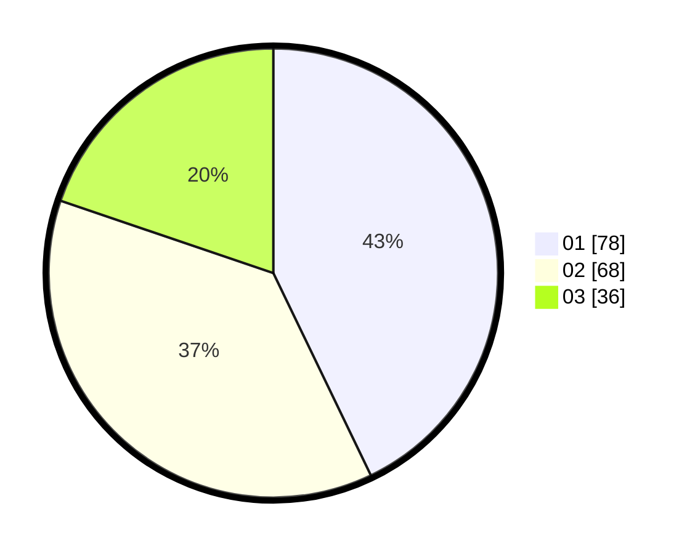

# Hasil

Hasil perolehan suara paslon dapat dilihat pada file paslon-01.txt, paslon-02.txt, dan paslon-03.txt.

Jika tidak ada, artinya data tersebut belum ada pada SIREKAP.

## Perolehan Suara

 * Paslon 01: **78**.
 * Paslon 02: **68**.
 * Paslon 03: **36**.

## Foto C Plano

https://sirekap-obj-formc.kpu.go.id/f4f2/pemilu/ppwp/31/73/04/10/05/3173041005044-20240216-021432--a3e639ba-a371-44e8-abb0-a2eec0008fea.jpg

https://sirekap-obj-formc.kpu.go.id/f4f2/pemilu/ppwp/31/73/04/10/05/3173041005044-20240216-021453--bf7a0f53-b657-49e2-8dbb-100e3022e865.jpg

https://sirekap-obj-formc.kpu.go.id/f4f2/pemilu/ppwp/31/73/04/10/05/3173041005044-20240216-175914--800835e9-3d07-469b-86bc-4422f48bb91a.jpg

## DATA PEMILIH TETAP

Jumlah pemilih dalam DPT: **277**.
 * L: **145**.
 * P: **132**.

## DATA PENGGUNA HAK PILIH

Jumlah pengguna hak pilih dalam DPT: **179**.
 * L: **92**.
 * P: **87**.

Jumlah pengguna hak pilih dalam DPTb: **1**.
 * L: **1**.
 * P: **0**.

Jumlah pengguna hak pilih dalam DPK: **4**.
 * L: **2**.
 * P: **2**.

Jumlah pengguna hak pilih: **184**.
 * L: **95**.
 * P: **89**.

## JUMLAH SUARA SAH DAN TIDAK SAH

JUMLAH SELURUH SUARA SAH: **182**.

JUMLAH SUARA TIDAK SAH: **2**.

JUMLAH SELURUH SUARA SAH DAN SUARA TIDAK SAH: **184**.
