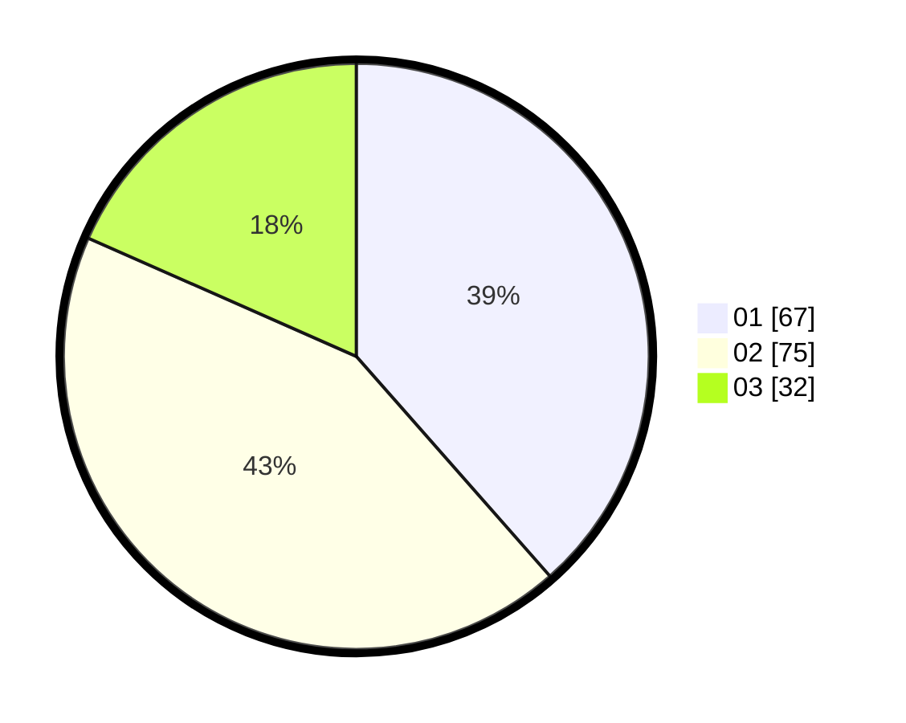

# Hasil

Hasil perolehan suara paslon dapat dilihat pada file paslon-01.txt, paslon-02.txt, dan paslon-03.txt.

Jika tidak ada, artinya data tersebut belum ada pada SIREKAP.

## Perolehan Suara

 * Paslon 01: **67**.
 * Paslon 02: **75**.
 * Paslon 03: **32**.

## Foto C Plano

https://sirekap-obj-formc.kpu.go.id/e5e6/pemilu/ppwp/31/73/04/10/05/3173041005047-20240214-230443--f672f8b0-e796-4af5-aa5f-a6ef8ec66000.jpg

https://sirekap-obj-formc.kpu.go.id/e5e6/pemilu/ppwp/31/73/04/10/05/3173041005047-20240214-230705--22fe411c-ce77-44b0-a294-9a74fd1375dc.jpg

https://sirekap-obj-formc.kpu.go.id/e5e6/pemilu/ppwp/31/73/04/10/05/3173041005047-20240214-231439--6f100e76-ba16-4f85-bdcf-0be47e323ae3.jpg
