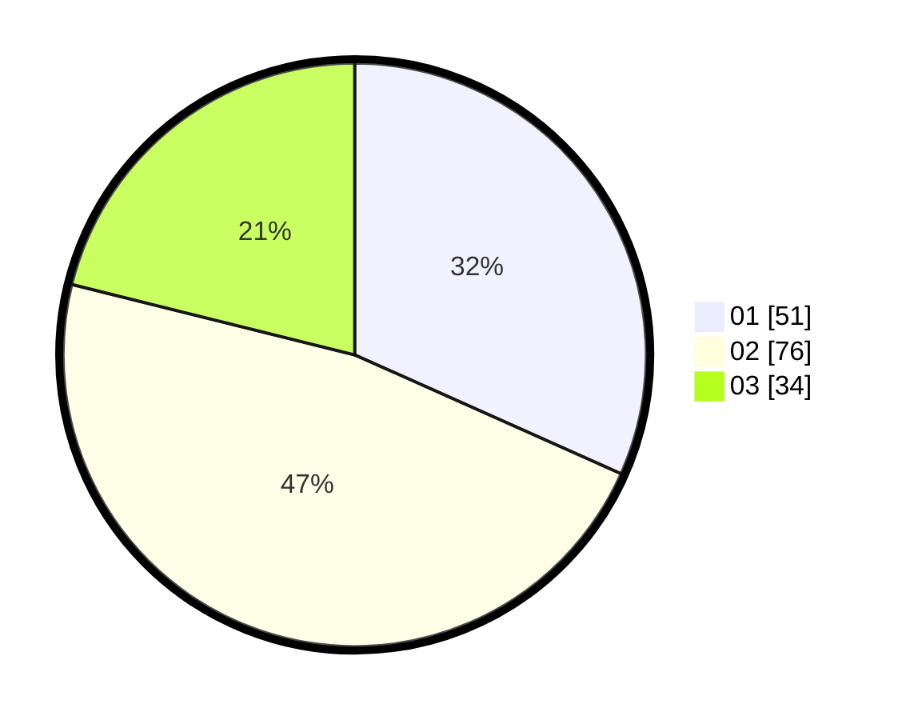

# Hasil

Hasil perolehan suara paslon dapat dilihat pada file paslon-01.txt, paslon-02.txt, dan paslon-03.txt.

Jika tidak ada, artinya data tersebut belum ada pada SIREKAP.

## Perolehan Suara

 * Paslon 01: **51**.
 * Paslon 02: **76**.
 * Paslon 03: **34**.

## Foto C Plano

https://sirekap-obj-formc.kpu.go.id/5ff5/pemilu/ppwp/31/73/04/10/05/3173041005048-20240216-051656--8927e7af-8419-4b2e-88f5-c079e9aa04a2.jpg

https://sirekap-obj-formc.kpu.go.id/5ff5/pemilu/ppwp/31/73/04/10/05/3173041005048-20240216-051708--5639f09e-633e-4387-bc18-7efd6a866108.jpg

https://sirekap-obj-formc.kpu.go.id/5ff5/pemilu/ppwp/31/73/04/10/05/3173041005048-20240216-051656--2519d210-4499-4389-8f93-322d3122fc62.jpg

## DATA PEMILIH TETAP

Jumlah pemilih dalam DPT: **251**.
 * L: **125**.
 * P: **126**.

## DATA PENGGUNA HAK PILIH

Jumlah pengguna hak pilih dalam DPT: **160**.
 * L: **77**.
 * P: **83**.

Jumlah pengguna hak pilih dalam DPTb: **0**.
 * L: **0**.
 * P: **0**.

Jumlah pengguna hak pilih dalam DPK: **4**.
 * L: **3**.
 * P: **1**.

Jumlah pengguna hak pilih: **164**.
 * L: **160**.
 * P: **4**.

## JUMLAH SUARA SAH DAN TIDAK SAH

JUMLAH SELURUH SUARA SAH: **161**.

JUMLAH SUARA TIDAK SAH: **3**.

JUMLAH SELURUH SUARA SAH DAN SUARA TIDAK SAH: **164**.
