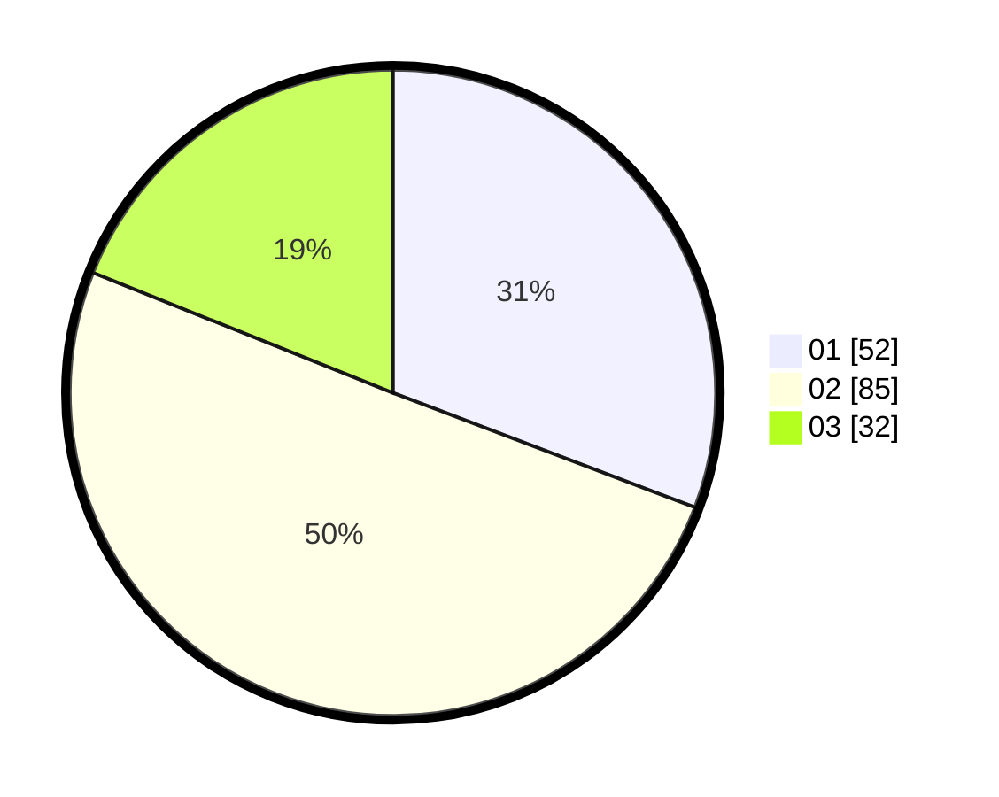

# Hasil

Hasil perolehan suara paslon dapat dilihat pada file paslon-01.txt, paslon-02.txt, dan paslon-03.txt.

Jika tidak ada, artinya data tersebut belum ada pada SIREKAP.

## Perolehan Suara

 * Paslon 01: **52**.
 * Paslon 02: **85**.
 * Paslon 03: **32**.

## Foto C Plano

https://sirekap-obj-formc.kpu.go.id/c918/pemilu/ppwp/31/73/04/10/05/3173041005054-20240215-050646--a6fb8aef-7924-4c0b-a67a-c7caeac10a29.jpg

https://sirekap-obj-formc.kpu.go.id/c918/pemilu/ppwp/31/73/04/10/05/3173041005054-20240215-050707--695ec2ea-0688-400e-ab7e-b2317c857cf2.jpg

https://sirekap-obj-formc.kpu.go.id/c918/pemilu/ppwp/31/73/04/10/05/3173041005054-20240215-050656--1c2dff0b-63cf-40be-913e-2370559a36dc.jpg

## DATA PEMILIH TETAP

Jumlah pemilih dalam DPT: **249**.
 * L: **123**.
 * P: **126**.

## DATA PENGGUNA HAK PILIH

Jumlah pengguna hak pilih dalam DPT: **169**.
 * L: **85**.
 * P: **84**.

Jumlah pengguna hak pilih dalam DPTb: **1**.
 * L: **0**.
 * P: **1**.

Jumlah pengguna hak pilih dalam DPK: **1**.
 * L: **1**.
 * P: **0**.

Jumlah pengguna hak pilih: **171**.
 * L: **86**.
 * P: **85**.

## JUMLAH SUARA SAH DAN TIDAK SAH

JUMLAH SELURUH SUARA SAH: **169**.

JUMLAH SUARA TIDAK SAH: **2**.

JUMLAH SELURUH SUARA SAH DAN SUARA TIDAK SAH: **171**.
