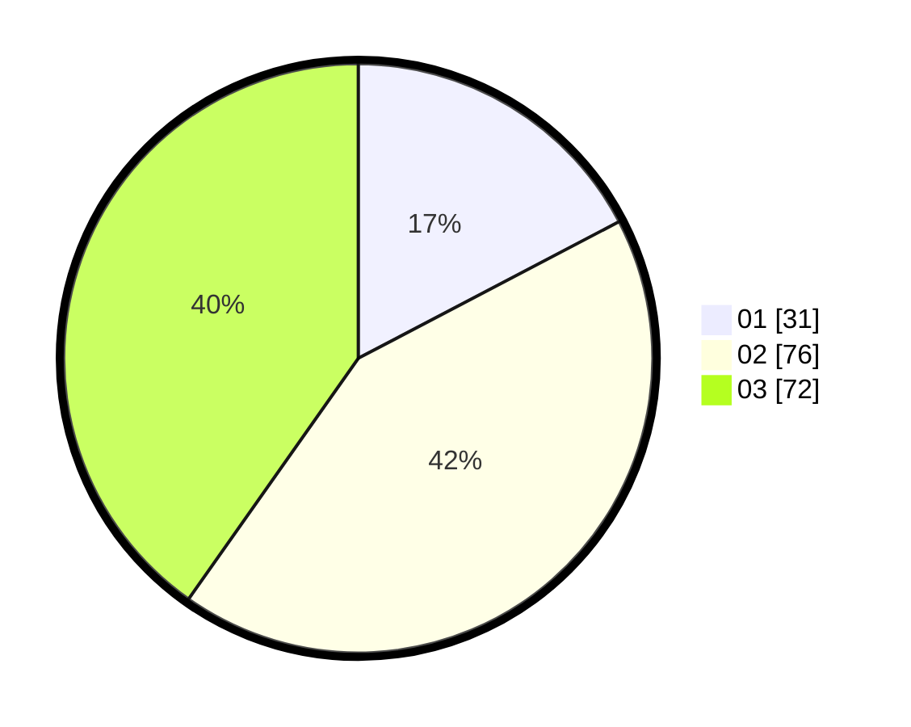

# Hasil

Hasil perolehan suara paslon dapat dilihat pada file paslon-01.txt, paslon-02.txt, dan paslon-03.txt.

Jika tidak ada, artinya data tersebut belum ada pada SIREKAP.

## Perolehan Suara

 * Paslon 01: **31**.
 * Paslon 02: **76**.
 * Paslon 03: **72**.

## Foto C Plano

https://sirekap-obj-formc.kpu.go.id/78d3/pemilu/ppwp/31/73/04/10/05/3173041005056-20240215-212404--19c3cd8c-204a-472f-a196-07ca5c30723c.jpg

https://sirekap-obj-formc.kpu.go.id/78d3/pemilu/ppwp/31/73/04/10/05/3173041005056-20240215-212406--2a0e08fe-9f19-48d3-9867-751ef8beae40.jpg

https://sirekap-obj-formc.kpu.go.id/78d3/pemilu/ppwp/31/73/04/10/05/3173041005056-20240215-212405--e3b20418-7f05-4041-9fbb-8fbcfba8a3b7.jpg

## DATA PEMILIH TETAP

Jumlah pemilih dalam DPT: **0**.
 * L: **0**.
 * P: **0**.

## DATA PENGGUNA HAK PILIH

Jumlah pengguna hak pilih dalam DPT: **0**.
 * L: **0**.
 * P: **0**.

Jumlah pengguna hak pilih dalam DPTb: **0**.
 * L: **0**.
 * P: **0**.

Jumlah pengguna hak pilih dalam DPK: **0**.
 * L: **0**.
 * P: **0**.

Jumlah pengguna hak pilih: **0**.
 * L: **0**.
 * P: **0**.

## JUMLAH SUARA SAH DAN TIDAK SAH

JUMLAH SELURUH SUARA SAH: **179**.

JUMLAH SUARA TIDAK SAH: **0**.

JUMLAH SELURUH SUARA SAH DAN SUARA TIDAK SAH: **179**.
