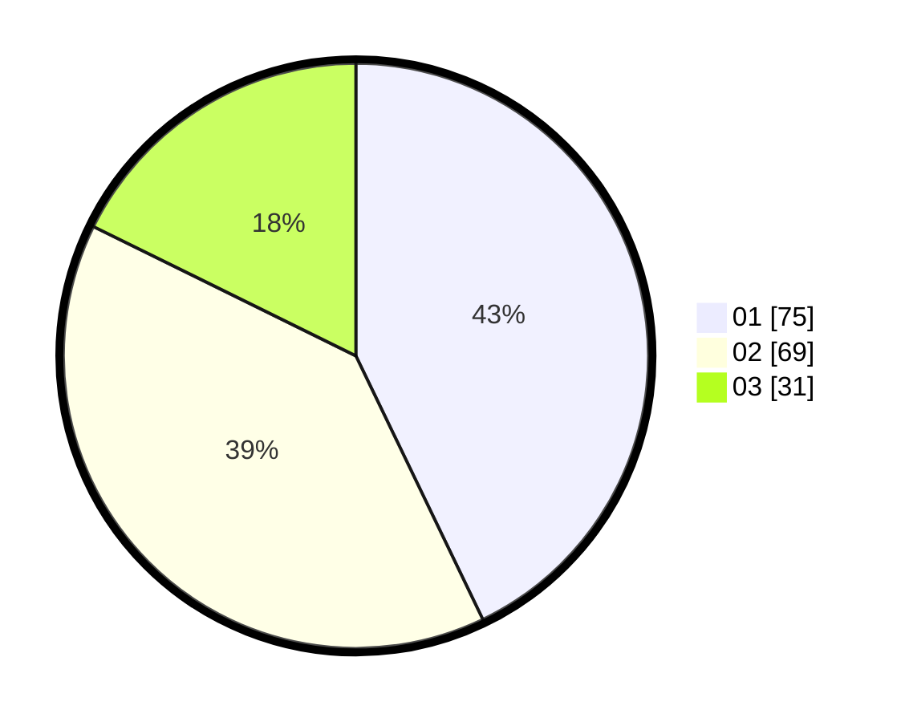

# Hasil

Hasil perolehan suara paslon dapat dilihat pada file paslon-01.txt, paslon-02.txt, dan paslon-03.txt.

Jika tidak ada, artinya data tersebut belum ada pada SIREKAP.

## Perolehan Suara

 * Paslon 01: **75**.
 * Paslon 02: **69**.
 * Paslon 03: **31**.

## Foto C Plano

https://sirekap-obj-formc.kpu.go.id/477b/pemilu/ppwp/31/73/04/10/05/3173041005057-20240215-204000--b2b7a9d7-5651-48d0-ad1a-243996a78403.jpg

https://sirekap-obj-formc.kpu.go.id/477b/pemilu/ppwp/31/73/04/10/05/3173041005057-20240215-204009--1c34c363-1d2d-485a-9756-ff04bf6bba56.jpg

https://sirekap-obj-formc.kpu.go.id/477b/pemilu/ppwp/31/73/04/10/05/3173041005057-20240215-204005--ad33c45b-6992-4b3a-a571-9c3ab80d592b.jpg

## DATA PEMILIH TETAP

Jumlah pemilih dalam DPT: **241**.
 * L: **120**.
 * P: **121**.

## DATA PENGGUNA HAK PILIH

Jumlah pengguna hak pilih dalam DPT: **177**.
 * L: **89**.
 * P: **88**.

Jumlah pengguna hak pilih dalam DPTb: **0**.
 * L: **0**.
 * P: **0**.

Jumlah pengguna hak pilih dalam DPK: **0**.
 * L: **0**.
 * P: **0**.

Jumlah pengguna hak pilih: **177**.
 * L: **89**.
 * P: **88**.

## JUMLAH SUARA SAH DAN TIDAK SAH

JUMLAH SELURUH SUARA SAH: **175**.

JUMLAH SUARA TIDAK SAH: **2**.

JUMLAH SELURUH SUARA SAH DAN SUARA TIDAK SAH: **177**.
