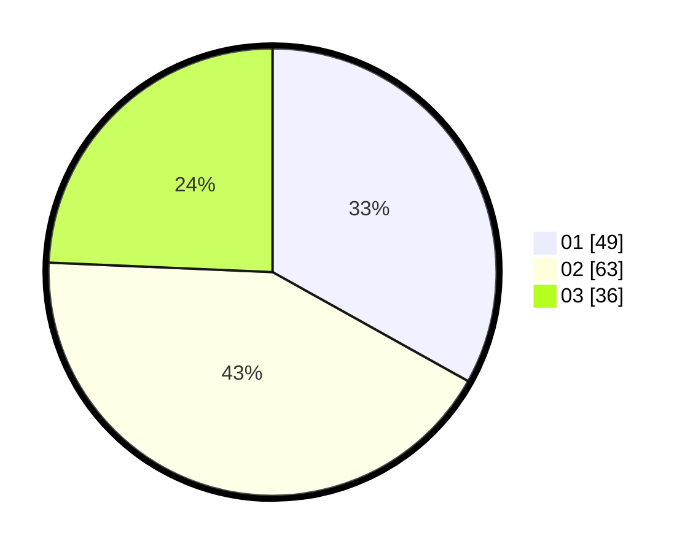

# Hasil

Hasil perolehan suara paslon dapat dilihat pada file paslon-01.txt, paslon-02.txt, dan paslon-03.txt.

Jika tidak ada, artinya data tersebut belum ada pada SIREKAP.

## Perolehan Suara

 * Paslon 01: **49**.
 * Paslon 02: **63**.
 * Paslon 03: **36**.

## Foto C Plano

https://sirekap-obj-formc.kpu.go.id/16dd/pemilu/ppwp/31/73/04/10/05/3173041005059-20240214-185013--629969de-dbc2-4069-89d2-fbc367d85c59.jpg

https://sirekap-obj-formc.kpu.go.id/16dd/pemilu/ppwp/31/73/04/10/05/3173041005059-20240216-003532--747de3b5-0838-4d56-8432-ec7cd5e7b5c4.jpg

https://sirekap-obj-formc.kpu.go.id/16dd/pemilu/ppwp/31/73/04/10/05/3173041005059-20240216-003531--d6e60175-3258-48be-a800-9a9bcd0f3500.jpg

## DATA PEMILIH TETAP

Jumlah pemilih dalam DPT: **245**.
 * L: **139**.
 * P: **106**.

## DATA PENGGUNA HAK PILIH

Jumlah pengguna hak pilih dalam DPT: **149**.
 * L: **77**.
 * P: **72**.

Jumlah pengguna hak pilih dalam DPTb: **2**.
 * L: **1**.
 * P: **1**.

Jumlah pengguna hak pilih dalam DPK: **0**.
 * L: **0**.
 * P: **0**.

Jumlah pengguna hak pilih: **151**.
 * L: **78**.
 * P: **73**.

## JUMLAH SUARA SAH DAN TIDAK SAH

JUMLAH SELURUH SUARA SAH: **148**.

JUMLAH SUARA TIDAK SAH: **3**.

JUMLAH SELURUH SUARA SAH DAN SUARA TIDAK SAH: **151**.
