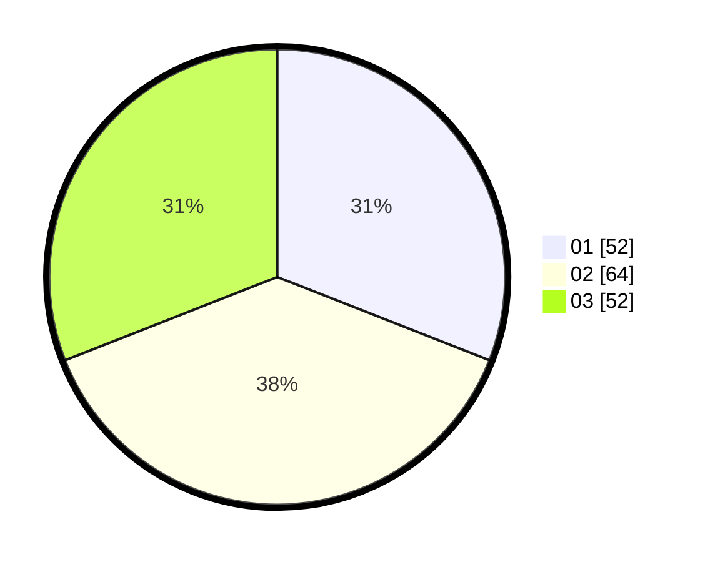

# Hasil

Hasil perolehan suara paslon dapat dilihat pada file paslon-01.txt, paslon-02.txt, dan paslon-03.txt.

Jika tidak ada, artinya data tersebut belum ada pada SIREKAP.

## Perolehan Suara

 * Paslon 01: **52**.
 * Paslon 02: **64**.
 * Paslon 03: **52**.

## Foto C Plano

https://sirekap-obj-formc.kpu.go.id/6f6d/pemilu/ppwp/31/73/04/10/05/3173041005063-20240214-160100--b68872f7-60af-4642-afb7-9a09da2a6396.jpg

https://sirekap-obj-formc.kpu.go.id/6f6d/pemilu/ppwp/31/73/04/10/05/3173041005063-20240214-155656--316b5b72-3c06-4a57-9da6-127061a0c7d4.jpg

https://sirekap-obj-formc.kpu.go.id/6f6d/pemilu/ppwp/31/73/04/10/05/3173041005063-20240214-155804--e298cc4c-5de1-4733-97b3-f8bdd618a55c.jpg

## DATA PEMILIH TETAP

Jumlah pemilih dalam DPT: **242**.
 * L: **132**.
 * P: **110**.

## DATA PENGGUNA HAK PILIH

Jumlah pengguna hak pilih dalam DPT: **173**.
 * L: **91**.
 * P: **82**.

Jumlah pengguna hak pilih dalam DPTb: **0**.
 * L: **0**.
 * P: **0**.

Jumlah pengguna hak pilih dalam DPK: **0**.
 * L: **0**.
 * P: **0**.

Jumlah pengguna hak pilih: **173**.
 * L: **91**.
 * P: **82**.

## JUMLAH SUARA SAH DAN TIDAK SAH

JUMLAH SELURUH SUARA SAH: **168**.

JUMLAH SUARA TIDAK SAH: **5**.

JUMLAH SELURUH SUARA SAH DAN SUARA TIDAK SAH: **173**.
