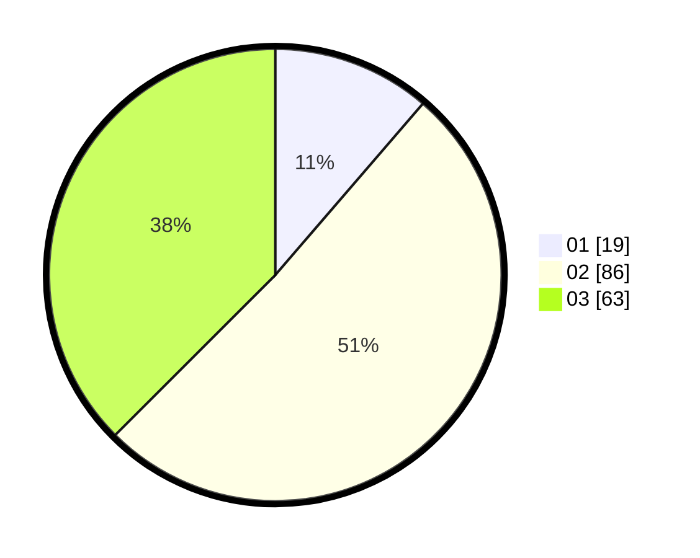

# Hasil

Hasil perolehan suara paslon dapat dilihat pada file paslon-01.txt, paslon-02.txt, dan paslon-03.txt.

Jika tidak ada, artinya data tersebut belum ada pada SIREKAP.

## Perolehan Suara

 * Paslon 01: **19**.
 * Paslon 02: **86**.
 * Paslon 03: **63**.

## Foto C Plano

https://sirekap-obj-formc.kpu.go.id/8d6f/pemilu/ppwp/31/73/04/10/05/3173041005065-20240216-013148--63c7bafa-1c38-4bdb-9d11-523e2d73a195.jpg

https://sirekap-obj-formc.kpu.go.id/8d6f/pemilu/ppwp/31/73/04/10/05/3173041005065-20240214-155117--4101e29b-a609-43c9-bf3e-b6ffce6b0e2e.jpg

https://sirekap-obj-formc.kpu.go.id/8d6f/pemilu/ppwp/31/73/04/10/05/3173041005065-20240214-155209--1c8d3e92-0a90-4bf3-bf43-4b7839e249c7.jpg

## DATA PEMILIH TETAP

Jumlah pemilih dalam DPT: **250**.
 * L: **130**.
 * P: **120**.

## DATA PENGGUNA HAK PILIH

Jumlah pengguna hak pilih dalam DPT: **170**.
 * L: **89**.
 * P: **81**.

Jumlah pengguna hak pilih dalam DPTb: **0**.
 * L: **0**.
 * P: **0**.

Jumlah pengguna hak pilih dalam DPK: **0**.
 * L: **0**.
 * P: **0**.

Jumlah pengguna hak pilih: **170**.
 * L: **89**.
 * P: **81**.

## JUMLAH SUARA SAH DAN TIDAK SAH

JUMLAH SELURUH SUARA SAH: **168**.

JUMLAH SUARA TIDAK SAH: **2**.

JUMLAH SELURUH SUARA SAH DAN SUARA TIDAK SAH: **170**.
