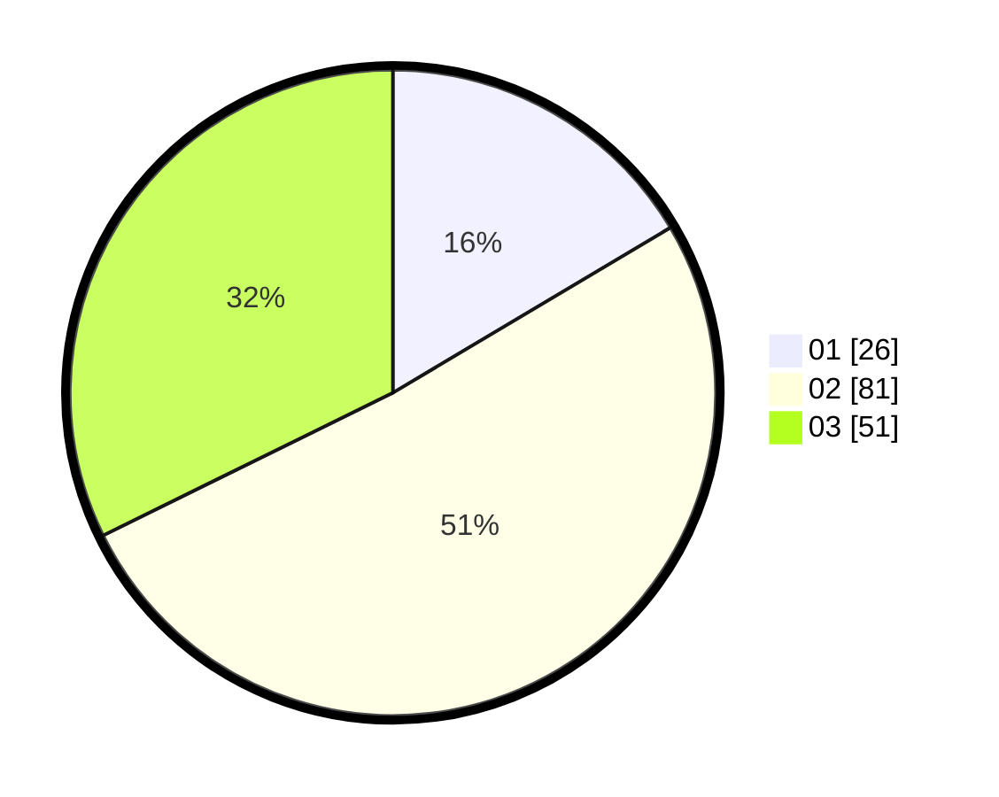

# Hasil

Hasil perolehan suara paslon dapat dilihat pada file paslon-01.txt, paslon-02.txt, dan paslon-03.txt.

Jika tidak ada, artinya data tersebut belum ada pada SIREKAP.

## Perolehan Suara

 * Paslon 01: **26**.
 * Paslon 02: **81**.
 * Paslon 03: **51**.

## Foto C Plano

https://sirekap-obj-formc.kpu.go.id/9292/pemilu/ppwp/31/73/04/10/05/3173041005066-20240215-214500--2f6aba97-e8cb-4074-8393-163cfa4c81d1.jpg

https://sirekap-obj-formc.kpu.go.id/9292/pemilu/ppwp/31/73/04/10/05/3173041005066-20240215-214504--72ee51d4-775c-49af-a0a5-b8abbd78993b.jpg

https://sirekap-obj-formc.kpu.go.id/9292/pemilu/ppwp/31/73/04/10/05/3173041005066-20240215-214503--660fd680-f03d-4a1e-8121-9a16493a3172.jpg

## DATA PEMILIH TETAP

Jumlah pemilih dalam DPT: **256**.
 * L: **129**.
 * P: **127**.

## DATA PENGGUNA HAK PILIH

Jumlah pengguna hak pilih dalam DPT: **152**.
 * L: **81**.
 * P: **71**.

Jumlah pengguna hak pilih dalam DPTb: **1**.
 * L: **1**.
 * P: **0**.

Jumlah pengguna hak pilih dalam DPK: **5**.
 * L: **1**.
 * P: **4**.

Jumlah pengguna hak pilih: **158**.
 * L: **83**.
 * P: **75**.

## JUMLAH SUARA SAH DAN TIDAK SAH

JUMLAH SELURUH SUARA SAH: **158**.

JUMLAH SUARA TIDAK SAH: **0**.

JUMLAH SELURUH SUARA SAH DAN SUARA TIDAK SAH: **158**.
