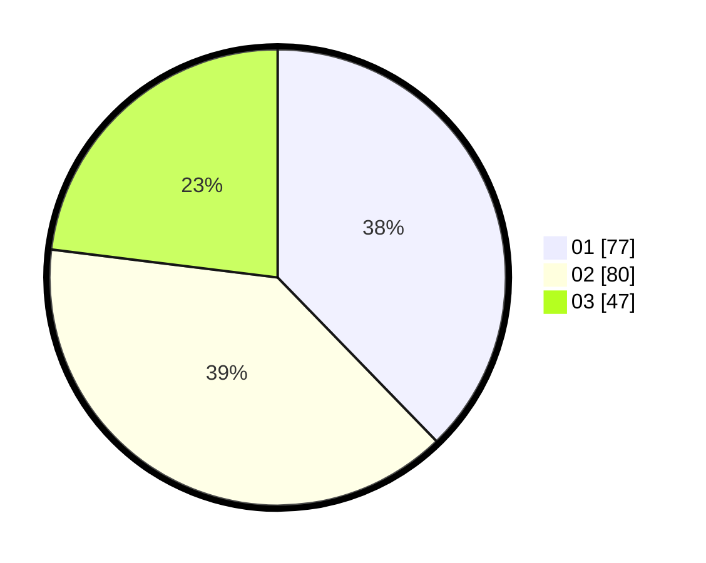

# Hasil

Hasil perolehan suara paslon dapat dilihat pada file paslon-01.txt, paslon-02.txt, dan paslon-03.txt.

Jika tidak ada, artinya data tersebut belum ada pada SIREKAP.

## Perolehan Suara

 * Paslon 01: **77**.
 * Paslon 02: **80**.
 * Paslon 03: **47**.

## Foto C Plano

https://sirekap-obj-formc.kpu.go.id/c0e0/pemilu/ppwp/31/73/04/10/06/3173041006001-20240215-084330--b0e2df0b-aafb-4f68-a3f3-5a9cb899aca6.jpg

https://sirekap-obj-formc.kpu.go.id/c0e0/pemilu/ppwp/31/73/04/10/06/3173041006001-20240215-084338--56939673-87c1-4eca-9920-03be7ec555a9.jpg

https://sirekap-obj-formc.kpu.go.id/c0e0/pemilu/ppwp/31/73/04/10/06/3173041006001-20240215-084341--8a6bd0ef-f3e0-488f-9e93-70b17ff844ef.jpg
