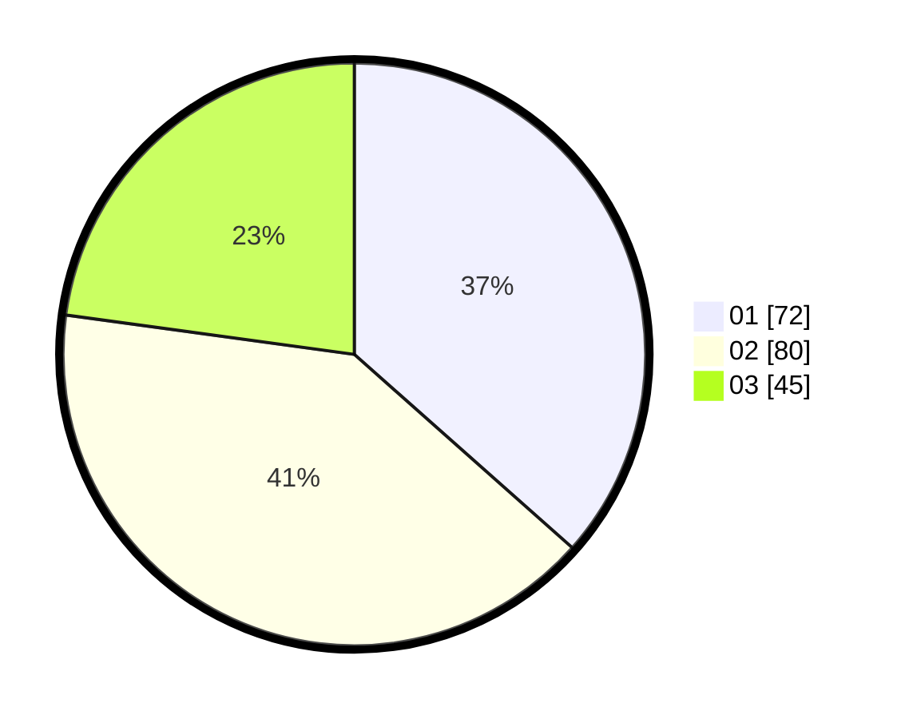

# Hasil

Hasil perolehan suara paslon dapat dilihat pada file paslon-01.txt, paslon-02.txt, dan paslon-03.txt.

Jika tidak ada, artinya data tersebut belum ada pada SIREKAP.

## Perolehan Suara

 * Paslon 01: **72**.
 * Paslon 02: **80**.
 * Paslon 03: **45**.

## Foto C Plano

https://sirekap-obj-formc.kpu.go.id/7596/pemilu/ppwp/31/73/04/10/06/3173041006002-20240214-222323--ad242c93-a79c-4759-9f02-d210a540f61b.jpg

https://sirekap-obj-formc.kpu.go.id/7596/pemilu/ppwp/31/73/04/10/06/3173041006002-20240214-192521--fe3c14bc-f0d7-4523-a4f2-acd1159a58c6.jpg

https://sirekap-obj-formc.kpu.go.id/7596/pemilu/ppwp/31/73/04/10/06/3173041006002-20240214-193019--aee2f249-2fca-4baa-a882-f8113e596c1b.jpg
