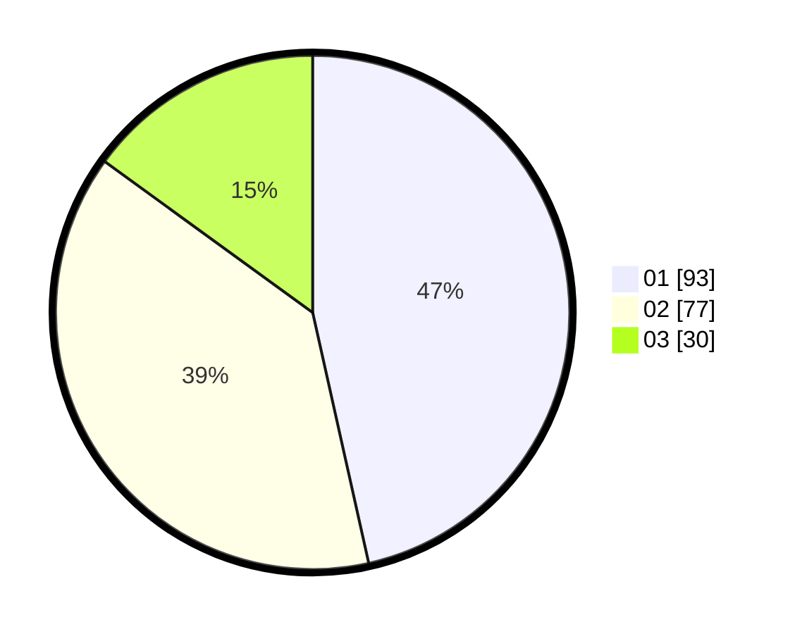

# Hasil

Hasil perolehan suara paslon dapat dilihat pada file paslon-01.txt, paslon-02.txt, dan paslon-03.txt.

Jika tidak ada, artinya data tersebut belum ada pada SIREKAP.

## Perolehan Suara

 * Paslon 01: **93**.
 * Paslon 02: **77**.
 * Paslon 03: **30**.

## Foto C Plano

https://sirekap-obj-formc.kpu.go.id/491c/pemilu/ppwp/31/73/04/10/06/3173041006003-20240214-212022--0beb06c2-7887-4f77-ac15-da4daff4d645.jpg

https://sirekap-obj-formc.kpu.go.id/491c/pemilu/ppwp/31/73/04/10/06/3173041006003-20240214-212113--d1699740-525d-41c1-a6de-3c5c42dbfa21.jpg

https://sirekap-obj-formc.kpu.go.id/491c/pemilu/ppwp/31/73/04/10/06/3173041006003-20240214-212225--a8ef3a2d-1beb-441a-bf74-ea03d5dacdb7.jpg
