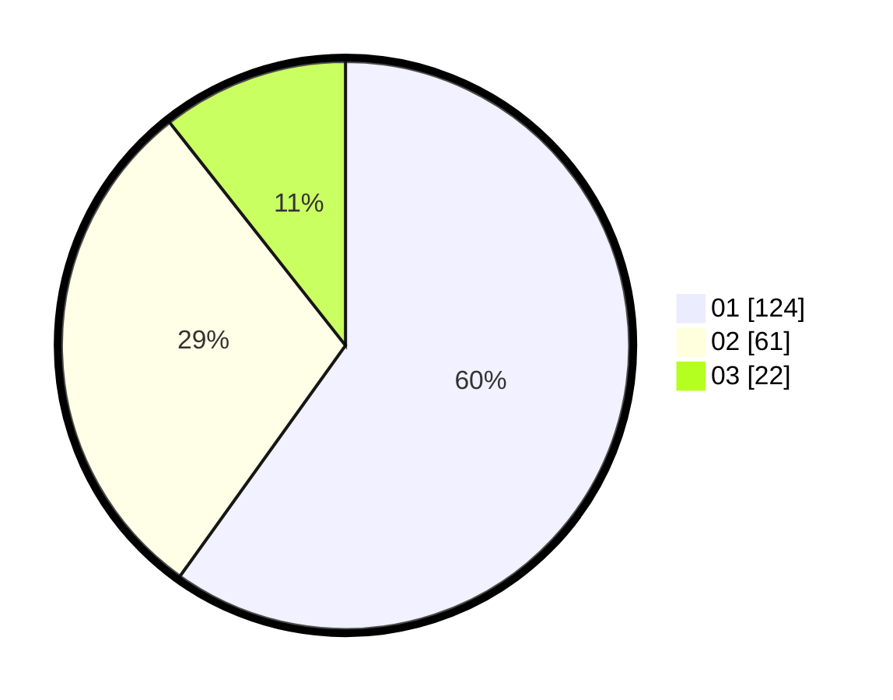

# Hasil

Hasil perolehan suara paslon dapat dilihat pada file paslon-01.txt, paslon-02.txt, dan paslon-03.txt.

Jika tidak ada, artinya data tersebut belum ada pada SIREKAP.

## Perolehan Suara

 * Paslon 01: **124**.
 * Paslon 02: **61**.
 * Paslon 03: **22**.

## Foto C Plano

https://sirekap-obj-formc.kpu.go.id/836b/pemilu/ppwp/31/73/04/10/06/3173041006010-20240214-211523--156274ce-3861-460b-afa1-875255b9fb1b.jpg

https://sirekap-obj-formc.kpu.go.id/836b/pemilu/ppwp/31/73/04/10/06/3173041006010-20240214-212119--f74cee3c-3269-48db-b3f8-b0bd0d525d21.jpg

https://sirekap-obj-formc.kpu.go.id/836b/pemilu/ppwp/31/73/04/10/06/3173041006010-20240214-212306--88270182-1da9-440c-9b5f-aa794636db46.jpg

## DATA PEMILIH TETAP

Jumlah pemilih dalam DPT: **270**.
 * L: **132**.
 * P: **138**.

## DATA PENGGUNA HAK PILIH

Jumlah pengguna hak pilih dalam DPT: **210**.
 * L: **106**.
 * P: **104**.

Jumlah pengguna hak pilih dalam DPTb: **0**.
 * L: **0**.
 * P: **0**.

Jumlah pengguna hak pilih dalam DPK: **0**.
 * L: **0**.
 * P: **0**.

Jumlah pengguna hak pilih: **210**.
 * L: **106**.
 * P: **104**.

## JUMLAH SUARA SAH DAN TIDAK SAH

JUMLAH SELURUH SUARA SAH: **207**.

JUMLAH SUARA TIDAK SAH: **3**.

JUMLAH SELURUH SUARA SAH DAN SUARA TIDAK SAH: **210**.
