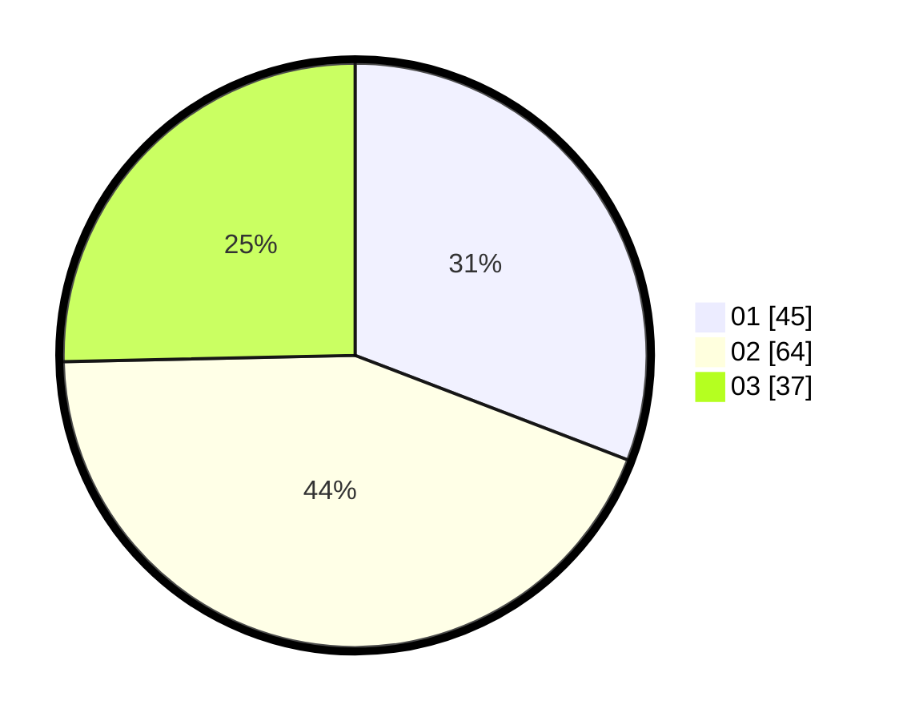

# Hasil

Hasil perolehan suara paslon dapat dilihat pada file paslon-01.txt, paslon-02.txt, dan paslon-03.txt.

Jika tidak ada, artinya data tersebut belum ada pada SIREKAP.

## Perolehan Suara

 * Paslon 01: **45**.
 * Paslon 02: **64**.
 * Paslon 03: **37**.

## Foto C Plano

https://sirekap-obj-formc.kpu.go.id/eb60/pemilu/ppwp/31/73/04/10/06/3173041006012-20240215-135401--1c48291f-272d-424b-919c-23c88ec7dd64.jpg

https://sirekap-obj-formc.kpu.go.id/eb60/pemilu/ppwp/31/73/04/10/06/3173041006012-20240214-232845--431ceed1-a87a-4487-bee1-d490e02f0aef.jpg

https://sirekap-obj-formc.kpu.go.id/eb60/pemilu/ppwp/31/73/04/10/06/3173041006012-20240214-232959--68244470-e3fd-40fb-b151-7bf32344d292.jpg
