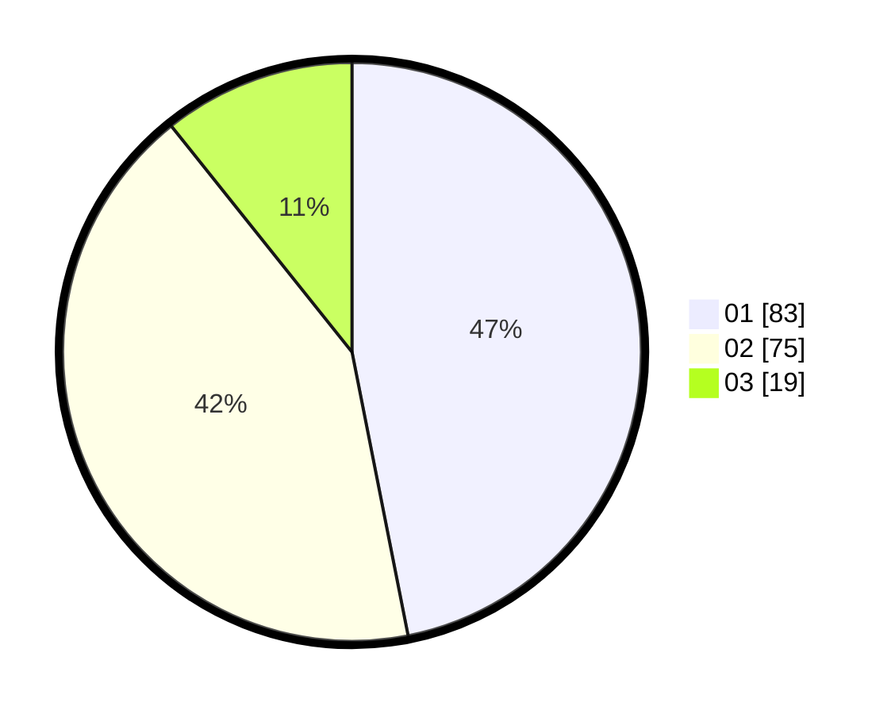

# Hasil

Hasil perolehan suara paslon dapat dilihat pada file paslon-01.txt, paslon-02.txt, dan paslon-03.txt.

Jika tidak ada, artinya data tersebut belum ada pada SIREKAP.

## Perolehan Suara

 * Paslon 01: **83**.
 * Paslon 02: **75**.
 * Paslon 03: **19**.

## Foto C Plano

https://sirekap-obj-formc.kpu.go.id/021d/pemilu/ppwp/31/73/04/10/06/3173041006013-20240216-015010--2bbccef8-8d31-499b-8668-fd6afb3ce2f2.jpg

https://sirekap-obj-formc.kpu.go.id/021d/pemilu/ppwp/31/73/04/10/06/3173041006013-20240214-194407--1f4f9e6e-f3b1-40a9-b3b1-3c6d2c39616f.jpg

https://sirekap-obj-formc.kpu.go.id/021d/pemilu/ppwp/31/73/04/10/06/3173041006013-20240214-194453--5e3930b4-ac6c-4f38-a7b2-ca513e1b0d7f.jpg

## DATA PEMILIH TETAP

Jumlah pemilih dalam DPT: **271**.
 * L: **140**.
 * P: **131**.

## DATA PENGGUNA HAK PILIH

Jumlah pengguna hak pilih dalam DPT: **177**.
 * L: **90**.
 * P: **87**.

Jumlah pengguna hak pilih dalam DPTb: **0**.
 * L: **0**.
 * P: **0**.

Jumlah pengguna hak pilih dalam DPK: **0**.
 * L: **0**.
 * P: **0**.

Jumlah pengguna hak pilih: **177**.
 * L: **90**.
 * P: **87**.

## JUMLAH SUARA SAH DAN TIDAK SAH

JUMLAH SELURUH SUARA SAH: **177**.

JUMLAH SUARA TIDAK SAH: **0**.

JUMLAH SELURUH SUARA SAH DAN SUARA TIDAK SAH: **177**.
