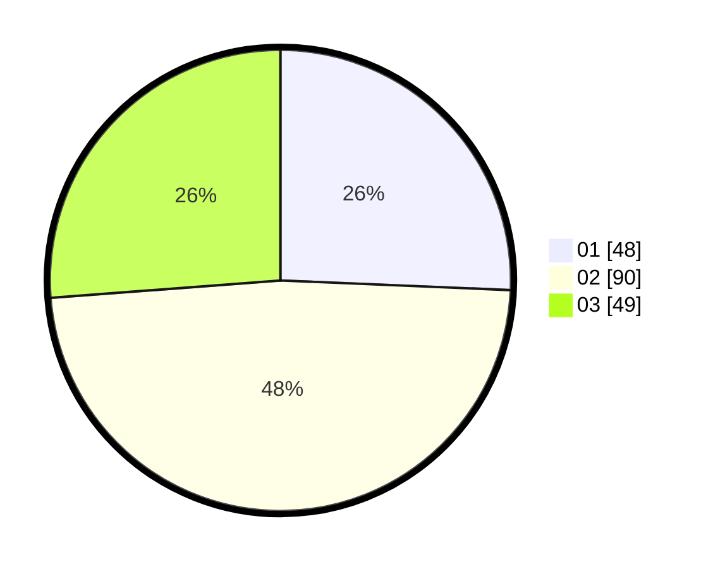

# Hasil

Hasil perolehan suara paslon dapat dilihat pada file paslon-01.txt, paslon-02.txt, dan paslon-03.txt.

Jika tidak ada, artinya data tersebut belum ada pada SIREKAP.

## Perolehan Suara

 * Paslon 01: **48**.
 * Paslon 02: **90**.
 * Paslon 03: **49**.

## Foto C Plano

https://sirekap-obj-formc.kpu.go.id/d560/pemilu/ppwp/31/73/04/10/06/3173041006014-20240215-020546--9bd5ed56-3428-425b-8d18-2aea3a4d1ec8.jpg

https://sirekap-obj-formc.kpu.go.id/d560/pemilu/ppwp/31/73/04/10/06/3173041006014-20240215-020751--951481df-3bc2-4ba5-910b-7e5f0f8cefae.jpg

https://sirekap-obj-formc.kpu.go.id/d560/pemilu/ppwp/31/73/04/10/06/3173041006014-20240215-020935--6a2d03e3-eb24-479e-a675-f0bc3103064e.jpg
