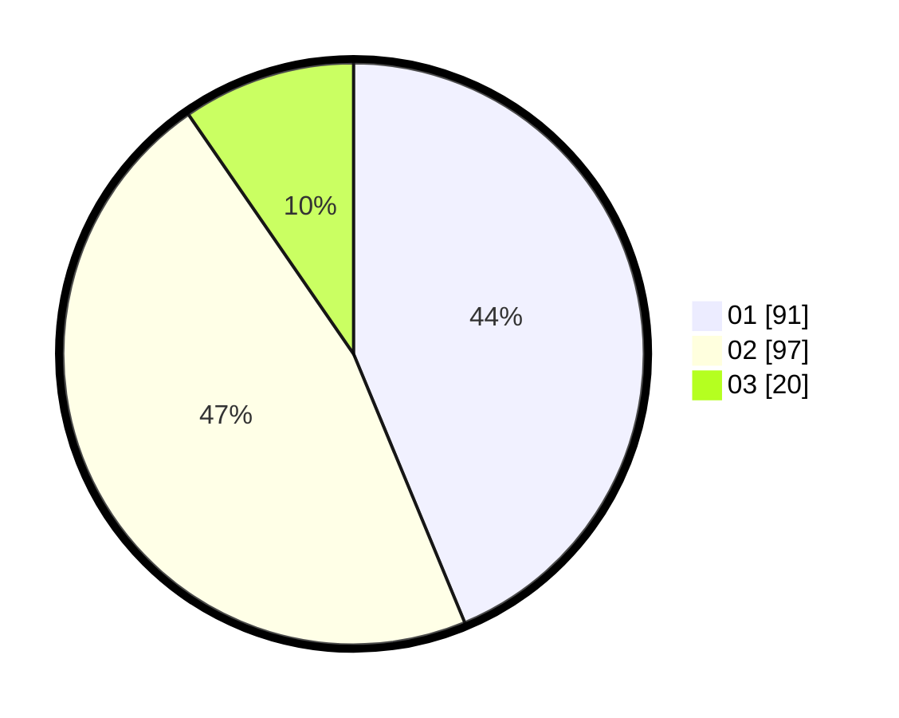

# Hasil

Hasil perolehan suara paslon dapat dilihat pada file paslon-01.txt, paslon-02.txt, dan paslon-03.txt.

Jika tidak ada, artinya data tersebut belum ada pada SIREKAP.

## Perolehan Suara

 * Paslon 01: **91**.
 * Paslon 02: **97**.
 * Paslon 03: **20**.

## Foto C Plano

https://sirekap-obj-formc.kpu.go.id/765d/pemilu/ppwp/31/73/04/10/06/3173041006015-20240215-005626--482730a1-e3d5-42ea-be6d-4842a6cab8e2.jpg

https://sirekap-obj-formc.kpu.go.id/765d/pemilu/ppwp/31/73/04/10/06/3173041006015-20240215-010615--2260eb80-0d7c-45ca-a01e-ee036fab7df0.jpg

https://sirekap-obj-formc.kpu.go.id/765d/pemilu/ppwp/31/73/04/10/06/3173041006015-20240215-010708--6f0b35fa-94d3-4493-8ba4-bb3d1744ab79.jpg
