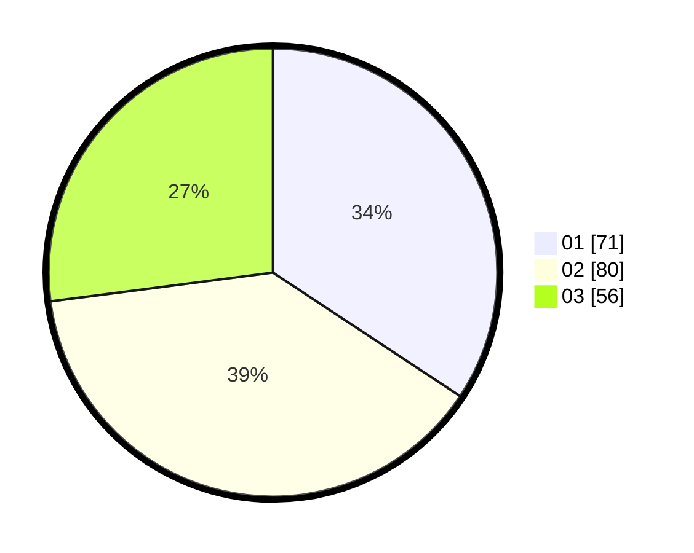

# Hasil

Hasil perolehan suara paslon dapat dilihat pada file paslon-01.txt, paslon-02.txt, dan paslon-03.txt.

Jika tidak ada, artinya data tersebut belum ada pada SIREKAP.

## Perolehan Suara

 * Paslon 01: **71**.
 * Paslon 02: **80**.
 * Paslon 03: **56**.

## Foto C Plano

https://sirekap-obj-formc.kpu.go.id/2b74/pemilu/ppwp/31/73/04/10/06/3173041006016-20240214-224558--5329e3aa-cc82-4b34-b968-25688e28a2ac.jpg

https://sirekap-obj-formc.kpu.go.id/2b74/pemilu/ppwp/31/73/04/10/06/3173041006016-20240214-224651--7dafce74-e8f3-406e-847d-ea688a931375.jpg

https://sirekap-obj-formc.kpu.go.id/2b74/pemilu/ppwp/31/73/04/10/06/3173041006016-20240214-224736--71633b6c-13cd-4a1b-9b82-1a035eb34729.jpg

## DATA PEMILIH TETAP

Jumlah pemilih dalam DPT: **271**.
 * L: **133**.
 * P: **138**.

## DATA PENGGUNA HAK PILIH

Jumlah pengguna hak pilih dalam DPT: **204**.
 * L: **103**.
 * P: **101**.

Jumlah pengguna hak pilih dalam DPTb: **4**.
 * L: **0**.
 * P: **4**.

Jumlah pengguna hak pilih dalam DPK: **0**.
 * L: **0**.
 * P: **0**.

Jumlah pengguna hak pilih: **208**.
 * L: **103**.
 * P: **105**.

## JUMLAH SUARA SAH DAN TIDAK SAH

JUMLAH SELURUH SUARA SAH: **207**.

JUMLAH SUARA TIDAK SAH: **1**.

JUMLAH SELURUH SUARA SAH DAN SUARA TIDAK SAH: **208**.
