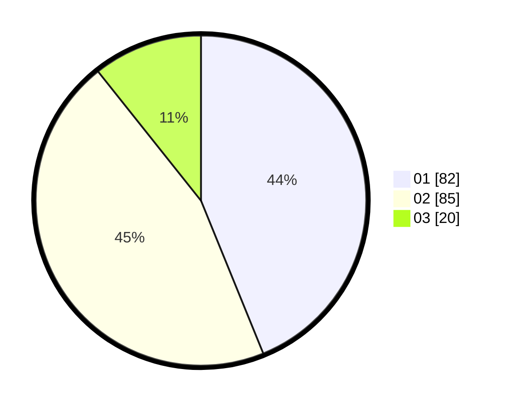

# Hasil

Hasil perolehan suara paslon dapat dilihat pada file paslon-01.txt, paslon-02.txt, dan paslon-03.txt.

Jika tidak ada, artinya data tersebut belum ada pada SIREKAP.

## Perolehan Suara

 * Paslon 01: **82**.
 * Paslon 02: **85**.
 * Paslon 03: **20**.

## Foto C Plano

https://sirekap-obj-formc.kpu.go.id/5523/pemilu/ppwp/31/73/04/10/06/3173041006019-20240214-230129--e0b62fea-c489-4c2a-b036-a0b0e1f9a1b0.jpg

https://sirekap-obj-formc.kpu.go.id/5523/pemilu/ppwp/31/73/04/10/06/3173041006019-20240214-225356--99f69065-eb2a-4acf-a51a-a29b01e0396c.jpg

https://sirekap-obj-formc.kpu.go.id/5523/pemilu/ppwp/31/73/04/10/06/3173041006019-20240214-225638--5a9916f7-7573-46d3-855e-eeda0b86bf09.jpg
