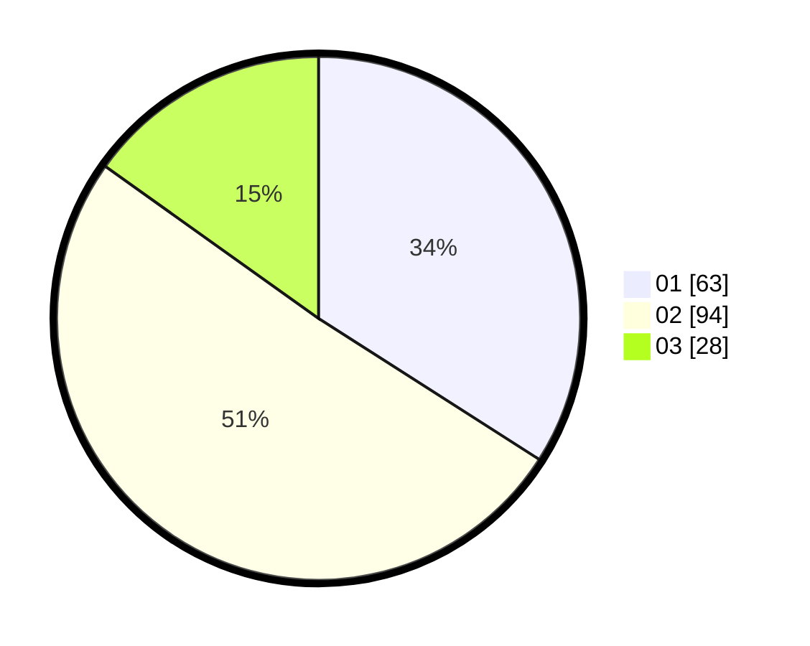

# Hasil

Hasil perolehan suara paslon dapat dilihat pada file paslon-01.txt, paslon-02.txt, dan paslon-03.txt.

Jika tidak ada, artinya data tersebut belum ada pada SIREKAP.

## Perolehan Suara

 * Paslon 01: **63**.
 * Paslon 02: **94**.
 * Paslon 03: **28**.

## Foto C Plano

https://sirekap-obj-formc.kpu.go.id/f369/pemilu/ppwp/31/73/04/10/06/3173041006020-20240214-230937--a4dc9b83-f060-413a-be52-95d654b7a756.jpg

https://sirekap-obj-formc.kpu.go.id/f369/pemilu/ppwp/31/73/04/10/06/3173041006020-20240214-231031--971e751d-71c9-4ff3-8fa0-abb583f6e908.jpg

https://sirekap-obj-formc.kpu.go.id/f369/pemilu/ppwp/31/73/04/10/06/3173041006020-20240214-231102--36fc558e-d6ef-4c7a-ab16-32254fff6fae.jpg
