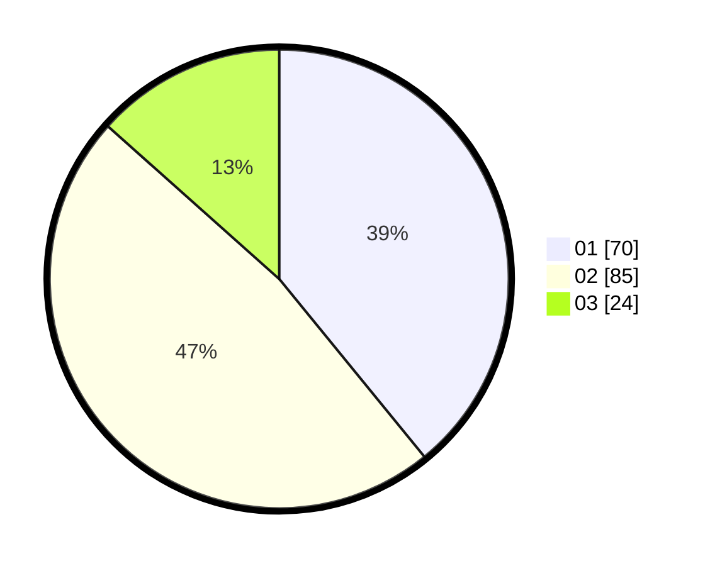

# Hasil

Hasil perolehan suara paslon dapat dilihat pada file paslon-01.txt, paslon-02.txt, dan paslon-03.txt.

Jika tidak ada, artinya data tersebut belum ada pada SIREKAP.

## Perolehan Suara

 * Paslon 01: **70**.
 * Paslon 02: **85**.
 * Paslon 03: **24**.

## Foto C Plano

https://sirekap-obj-formc.kpu.go.id/29ea/pemilu/ppwp/31/73/04/10/06/3173041006021-20240214-193622--2fdc058b-22e5-453d-8fe0-96f1a0265f6d.jpg

https://sirekap-obj-formc.kpu.go.id/29ea/pemilu/ppwp/31/73/04/10/06/3173041006021-20240214-193848--2c6ce1b2-29fa-4b36-af96-7d1bf17debaa.jpg

https://sirekap-obj-formc.kpu.go.id/29ea/pemilu/ppwp/31/73/04/10/06/3173041006021-20240214-193933--4486df65-71a7-45a7-8aca-0df03c412920.jpg

## DATA PEMILIH TETAP

Jumlah pemilih dalam DPT: **264**.
 * L: **140**.
 * P: **124**.

## DATA PENGGUNA HAK PILIH

Jumlah pengguna hak pilih dalam DPT: **181**.
 * L: **90**.
 * P: **91**.

Jumlah pengguna hak pilih dalam DPTb: **0**.
 * L: **0**.
 * P: **0**.

Jumlah pengguna hak pilih dalam DPK: **0**.
 * L: **0**.
 * P: **0**.

Jumlah pengguna hak pilih: **181**.
 * L: **90**.
 * P: **91**.

## JUMLAH SUARA SAH DAN TIDAK SAH

JUMLAH SELURUH SUARA SAH: **179**.

JUMLAH SUARA TIDAK SAH: **2**.

JUMLAH SELURUH SUARA SAH DAN SUARA TIDAK SAH: **181**.
