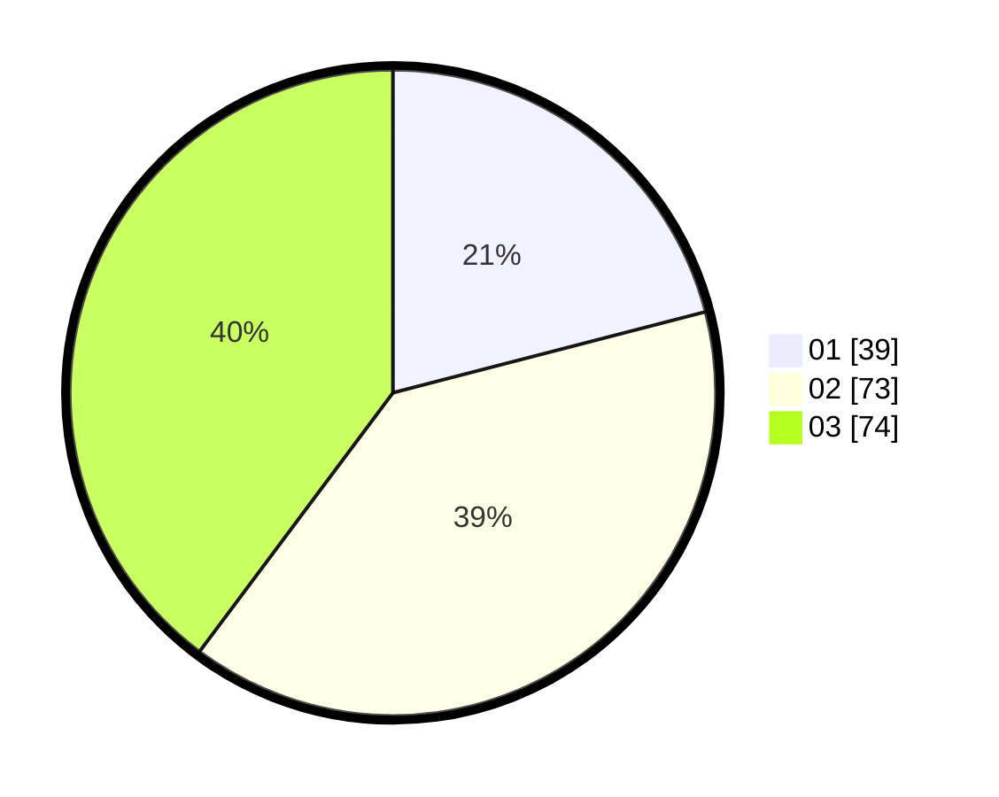

# Hasil

Hasil perolehan suara paslon dapat dilihat pada file paslon-01.txt, paslon-02.txt, dan paslon-03.txt.

Jika tidak ada, artinya data tersebut belum ada pada SIREKAP.

## Perolehan Suara

 * Paslon 01: **39**.
 * Paslon 02: **73**.
 * Paslon 03: **74**.

## Foto C Plano

https://sirekap-obj-formc.kpu.go.id/d8a0/pemilu/ppwp/31/73/04/10/06/3173041006025-20240214-225917--8df62eb5-4263-443a-93ab-72a864795b00.jpg

https://sirekap-obj-formc.kpu.go.id/d8a0/pemilu/ppwp/31/73/04/10/06/3173041006025-20240214-230020--7b18d0b2-6f2c-4992-a580-433400bd3558.jpg

https://sirekap-obj-formc.kpu.go.id/d8a0/pemilu/ppwp/31/73/04/10/06/3173041006025-20240214-230126--65f5b7b0-d732-43ee-9439-1dfeeb4d3df2.jpg
