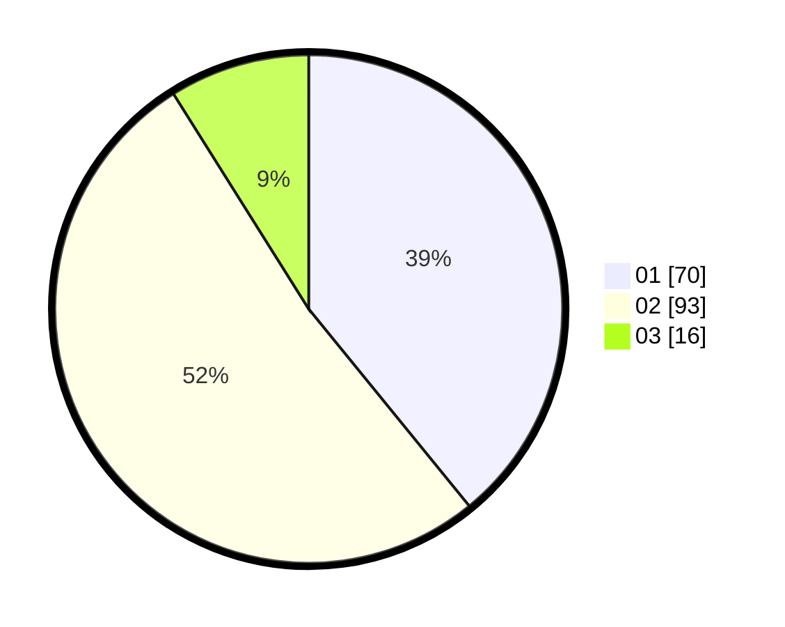

# Hasil

Hasil perolehan suara paslon dapat dilihat pada file paslon-01.txt, paslon-02.txt, dan paslon-03.txt.

Jika tidak ada, artinya data tersebut belum ada pada SIREKAP.

## Perolehan Suara

 * Paslon 01: **70**.
 * Paslon 02: **93**.
 * Paslon 03: **16**.

## Foto C Plano

https://sirekap-obj-formc.kpu.go.id/4ddf/pemilu/ppwp/31/73/04/10/06/3173041006028-20240214-223359--caebbb12-ae77-418c-9c0f-d123f4b72f2b.jpg

https://sirekap-obj-formc.kpu.go.id/4ddf/pemilu/ppwp/31/73/04/10/06/3173041006028-20240214-223834--6ef94294-b11c-44a9-909e-15acbf85b0bd.jpg

https://sirekap-obj-formc.kpu.go.id/4ddf/pemilu/ppwp/31/73/04/10/06/3173041006028-20240214-223724--f2cadf8d-d645-4388-8bad-6cbafe7ed3ef.jpg
