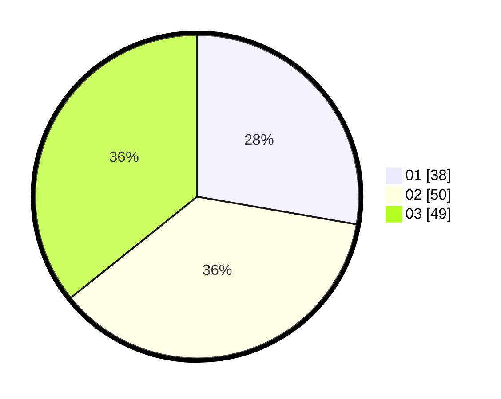

# Hasil

Hasil perolehan suara paslon dapat dilihat pada file paslon-01.txt, paslon-02.txt, dan paslon-03.txt.

Jika tidak ada, artinya data tersebut belum ada pada SIREKAP.

## Perolehan Suara

 * Paslon 01: **38**.
 * Paslon 02: **50**.
 * Paslon 03: **49**.

## Foto C Plano

https://sirekap-obj-formc.kpu.go.id/73b2/pemilu/ppwp/31/73/04/10/06/3173041006031-20240214-193310--6adada87-aca2-4580-b98d-82a4ec890750.jpg

https://sirekap-obj-formc.kpu.go.id/73b2/pemilu/ppwp/31/73/04/10/06/3173041006031-20240214-193135--2f877e8a-a727-4770-9370-c8716af9ea96.jpg
