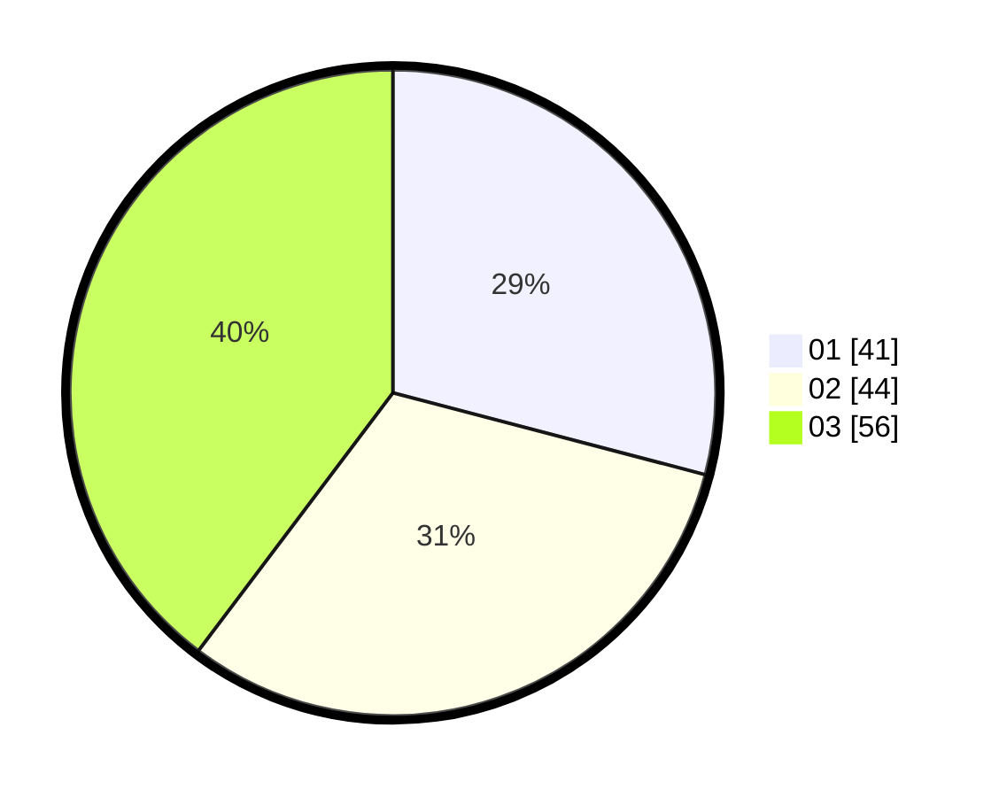

# Hasil

Hasil perolehan suara paslon dapat dilihat pada file paslon-01.txt, paslon-02.txt, dan paslon-03.txt.

Jika tidak ada, artinya data tersebut belum ada pada SIREKAP.

## Perolehan Suara

 * Paslon 01: **41**.
 * Paslon 02: **44**.
 * Paslon 03: **56**.

## Foto C Plano

https://sirekap-obj-formc.kpu.go.id/d9d3/pemilu/ppwp/31/73/04/10/06/3173041006032-20240214-212150--eeba845d-784a-445f-98d0-cdfab16ab20c.jpg

https://sirekap-obj-formc.kpu.go.id/d9d3/pemilu/ppwp/31/73/04/10/06/3173041006032-20240214-212731--9123c4e1-c2b1-41de-bc83-a4511b2e2ca3.jpg

https://sirekap-obj-formc.kpu.go.id/d9d3/pemilu/ppwp/31/73/04/10/06/3173041006032-20240214-212858--a01264be-7203-4855-a9b6-28fcea5d2720.jpg
