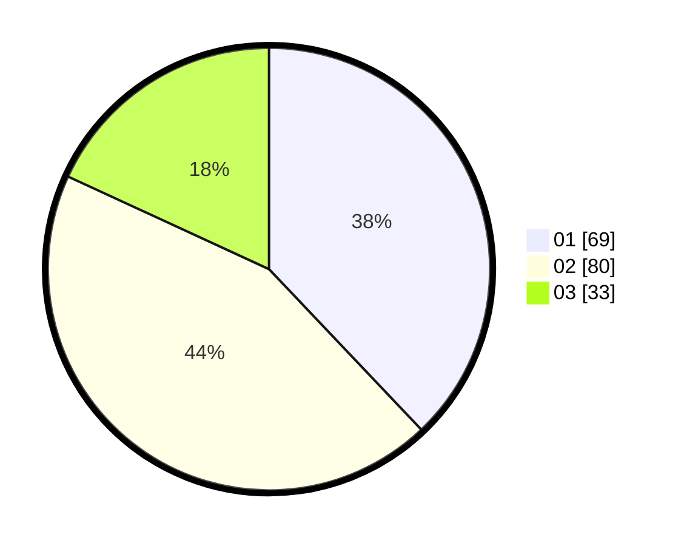

# Hasil

Hasil perolehan suara paslon dapat dilihat pada file paslon-01.txt, paslon-02.txt, dan paslon-03.txt.

Jika tidak ada, artinya data tersebut belum ada pada SIREKAP.

## Perolehan Suara

 * Paslon 01: **69**.
 * Paslon 02: **80**.
 * Paslon 03: **33**.

## Foto C Plano

https://sirekap-obj-formc.kpu.go.id/ed5e/pemilu/ppwp/31/73/04/10/06/3173041006034-20240214-230537--719d0bf8-27b8-4b5a-be29-646b0658e86e.jpg

https://sirekap-obj-formc.kpu.go.id/ed5e/pemilu/ppwp/31/73/04/10/06/3173041006034-20240214-230710--dc7f4afe-0fa8-48fb-9f2f-5589c6c50ed5.jpg

https://sirekap-obj-formc.kpu.go.id/ed5e/pemilu/ppwp/31/73/04/10/06/3173041006034-20240214-230909--6ab80ad4-f2c7-4432-ae5e-30fc0df7efe8.jpg
