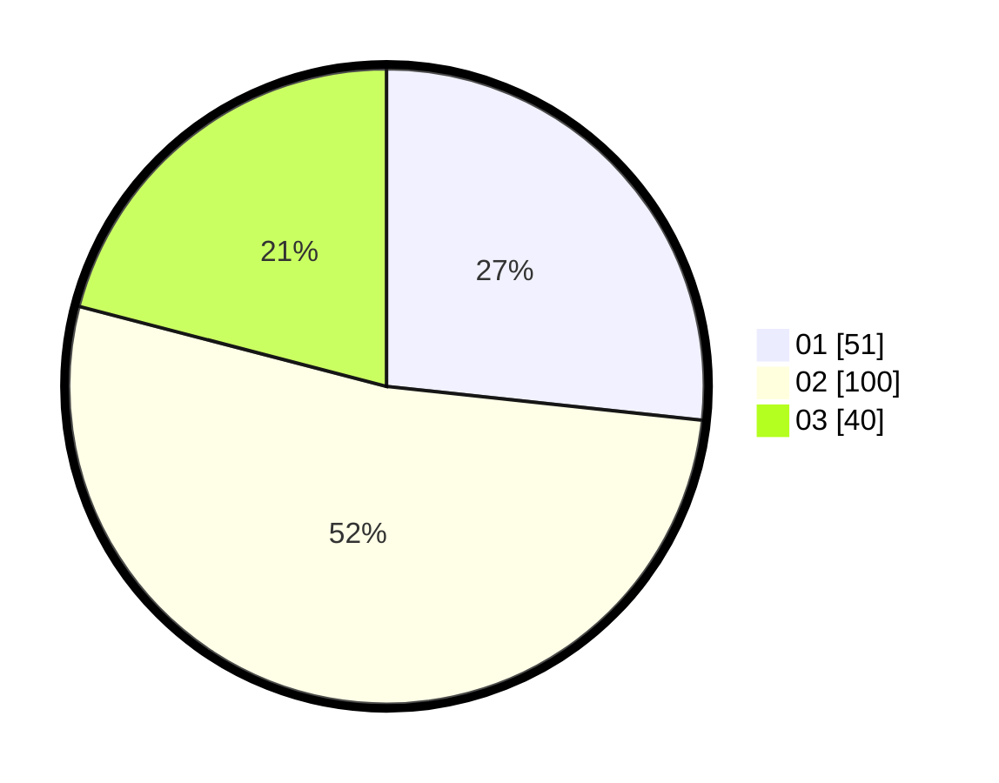

# Hasil

Hasil perolehan suara paslon dapat dilihat pada file paslon-01.txt, paslon-02.txt, dan paslon-03.txt.

Jika tidak ada, artinya data tersebut belum ada pada SIREKAP.

## Perolehan Suara

 * Paslon 01: **51**.
 * Paslon 02: **100**.
 * Paslon 03: **40**.

## Foto C Plano

https://sirekap-obj-formc.kpu.go.id/bacf/pemilu/ppwp/31/73/04/10/06/3173041006036-20240214-231449--2bdfbbc1-a22a-4817-9850-e8c60d9e6ad2.jpg

https://sirekap-obj-formc.kpu.go.id/bacf/pemilu/ppwp/31/73/04/10/06/3173041006036-20240214-231611--794f90cd-1464-4f32-ab7c-63ec163dc9ab.jpg

https://sirekap-obj-formc.kpu.go.id/bacf/pemilu/ppwp/31/73/04/10/06/3173041006036-20240214-231716--9fcced10-e0b7-48aa-a581-b70bb2e04453.jpg
