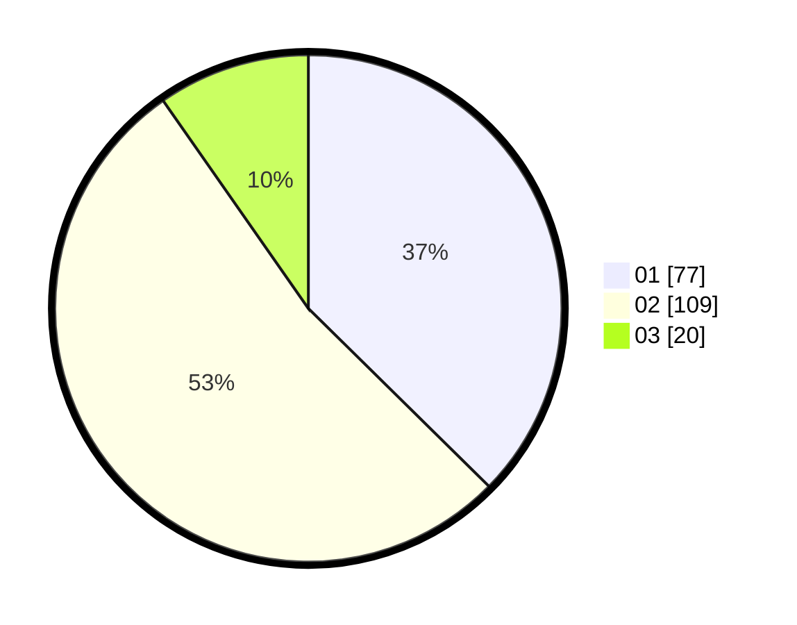

# Hasil

Hasil perolehan suara paslon dapat dilihat pada file paslon-01.txt, paslon-02.txt, dan paslon-03.txt.

Jika tidak ada, artinya data tersebut belum ada pada SIREKAP.

## Perolehan Suara

 * Paslon 01: **77**.
 * Paslon 02: **109**.
 * Paslon 03: **20**.

## Foto C Plano

https://sirekap-obj-formc.kpu.go.id/dec7/pemilu/ppwp/31/73/04/10/06/3173041006037-20240217-022544--7fa14f99-6a51-465c-8d2b-9d2b4c529cc9.jpg

https://sirekap-obj-formc.kpu.go.id/dec7/pemilu/ppwp/31/73/04/10/06/3173041006037-20240217-022615--a5951084-8d43-4fb5-92b4-8e7c3ce9f547.jpg

https://sirekap-obj-formc.kpu.go.id/dec7/pemilu/ppwp/31/73/04/10/06/3173041006037-20240217-022642--ce8ef1e1-2026-4aa3-a478-35b60787f6da.jpg
