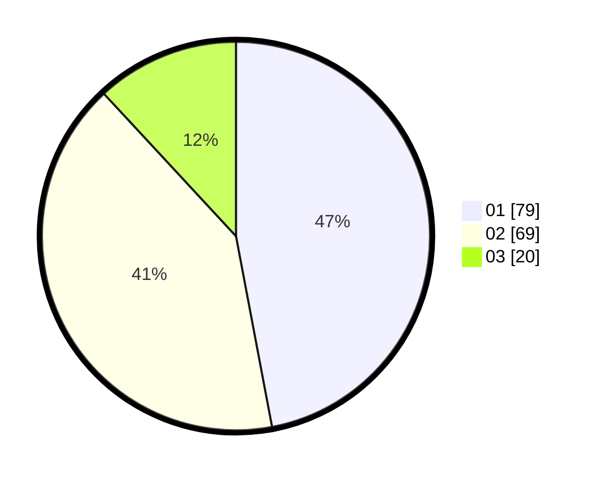

# Hasil

Hasil perolehan suara paslon dapat dilihat pada file paslon-01.txt, paslon-02.txt, dan paslon-03.txt.

Jika tidak ada, artinya data tersebut belum ada pada SIREKAP.

## Perolehan Suara

 * Paslon 01: **79**.
 * Paslon 02: **69**.
 * Paslon 03: **20**.

## Foto C Plano

https://sirekap-obj-formc.kpu.go.id/1658/pemilu/ppwp/31/73/04/10/06/3173041006044-20240214-192633--cc281309-41c8-4c35-9fb2-050e3d90bea5.jpg

https://sirekap-obj-formc.kpu.go.id/1658/pemilu/ppwp/31/73/04/10/06/3173041006044-20240214-200248--35663e9b-1f95-4b67-bf70-1bdde8772d83.jpg

https://sirekap-obj-formc.kpu.go.id/1658/pemilu/ppwp/31/73/04/10/06/3173041006044-20240214-192146--94eb92ec-bcd1-424d-bf47-d77a13269469.jpg

## DATA PEMILIH TETAP

Jumlah pemilih dalam DPT: **277**.
 * L: **154**.
 * P: **123**.

## DATA PENGGUNA HAK PILIH

Jumlah pengguna hak pilih dalam DPT: **171**.
 * L: **90**.
 * P: **81**.

Jumlah pengguna hak pilih dalam DPTb: **0**.
 * L: **0**.
 * P: **0**.

Jumlah pengguna hak pilih dalam DPK: **0**.
 * L: **0**.
 * P: **0**.

Jumlah pengguna hak pilih: **171**.
 * L: **90**.
 * P: **81**.

## JUMLAH SUARA SAH DAN TIDAK SAH

JUMLAH SELURUH SUARA SAH: **168**.

JUMLAH SUARA TIDAK SAH: **3**.

JUMLAH SELURUH SUARA SAH DAN SUARA TIDAK SAH: **171**.
