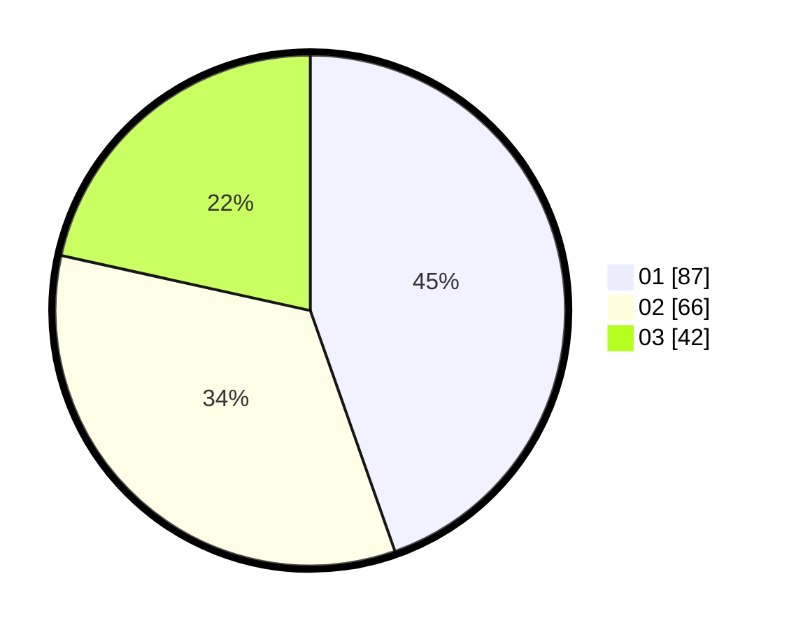

# Hasil

Hasil perolehan suara paslon dapat dilihat pada file paslon-01.txt, paslon-02.txt, dan paslon-03.txt.

Jika tidak ada, artinya data tersebut belum ada pada SIREKAP.

## Perolehan Suara

 * Paslon 01: **87**.
 * Paslon 02: **66**.
 * Paslon 03: **42**.

## Foto C Plano

https://sirekap-obj-formc.kpu.go.id/8763/pemilu/ppwp/31/73/04/10/06/3173041006048-20240214-155849--1a5be509-3326-4e50-896b-9ec24297a4dd.jpg

https://sirekap-obj-formc.kpu.go.id/8763/pemilu/ppwp/31/73/04/10/06/3173041006048-20240214-155914--f21fe925-fda7-407b-8296-5f5b45d57f13.jpg

https://sirekap-obj-formc.kpu.go.id/8763/pemilu/ppwp/31/73/04/10/06/3173041006048-20240214-160055--9cd0ca40-6b5c-4529-804a-5b2d9c0c5308.jpg

## DATA PEMILIH TETAP

Jumlah pemilih dalam DPT: **275**.
 * L: **136**.
 * P: **139**.

## DATA PENGGUNA HAK PILIH

Jumlah pengguna hak pilih dalam DPT: **194**.
 * L: **96**.
 * P: **98**.

Jumlah pengguna hak pilih dalam DPTb: **0**.
 * L: **0**.
 * P: **0**.

Jumlah pengguna hak pilih dalam DPK: **1**.
 * L: **0**.
 * P: **1**.

Jumlah pengguna hak pilih: **195**.
 * L: **96**.
 * P: **99**.

## JUMLAH SUARA SAH DAN TIDAK SAH

JUMLAH SELURUH SUARA SAH: **195**.

JUMLAH SUARA TIDAK SAH: **0**.

JUMLAH SELURUH SUARA SAH DAN SUARA TIDAK SAH: **195**.
