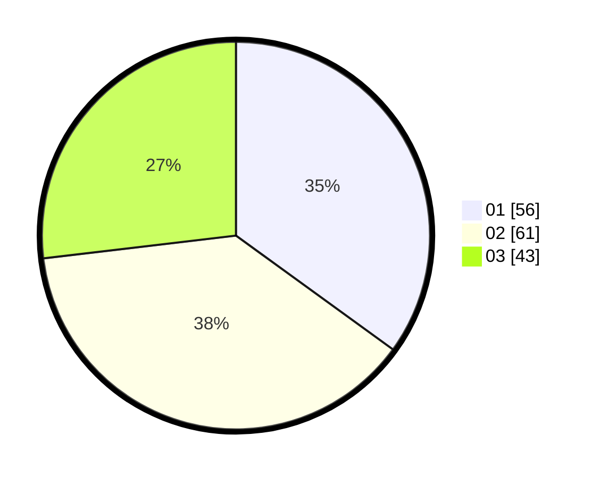

# Hasil

Hasil perolehan suara paslon dapat dilihat pada file paslon-01.txt, paslon-02.txt, dan paslon-03.txt.

Jika tidak ada, artinya data tersebut belum ada pada SIREKAP.

## Perolehan Suara

 * Paslon 01: **56**.
 * Paslon 02: **61**.
 * Paslon 03: **43**.

## Foto C Plano

https://sirekap-obj-formc.kpu.go.id/4210/pemilu/ppwp/31/73/04/10/06/3173041006059-20240214-221213--87955493-f789-4aaa-a9fc-c37bc8473bcd.jpg

https://sirekap-obj-formc.kpu.go.id/4210/pemilu/ppwp/31/73/04/10/06/3173041006059-20240214-221325--2ab6c0af-5a8f-42b6-b6a9-3cd0da6b982f.jpg

https://sirekap-obj-formc.kpu.go.id/4210/pemilu/ppwp/31/73/04/10/06/3173041006059-20240214-203447--0da9a08e-6436-4b11-9b35-d39106bbde1a.jpg

## DATA PEMILIH TETAP

Jumlah pemilih dalam DPT: **271**.
 * L: **148**.
 * P: **123**.

## DATA PENGGUNA HAK PILIH

Jumlah pengguna hak pilih dalam DPT: **160**.
 * L: **80**.
 * P: **80**.

Jumlah pengguna hak pilih dalam DPTb: **2**.
 * L: **1**.
 * P: **1**.

Jumlah pengguna hak pilih dalam DPK: **1**.
 * L: **1**.
 * P: **0**.

Jumlah pengguna hak pilih: **163**.
 * L: **82**.
 * P: **81**.

## JUMLAH SUARA SAH DAN TIDAK SAH

JUMLAH SELURUH SUARA SAH: **160**.

JUMLAH SUARA TIDAK SAH: **3**.

JUMLAH SELURUH SUARA SAH DAN SUARA TIDAK SAH: **163**.
