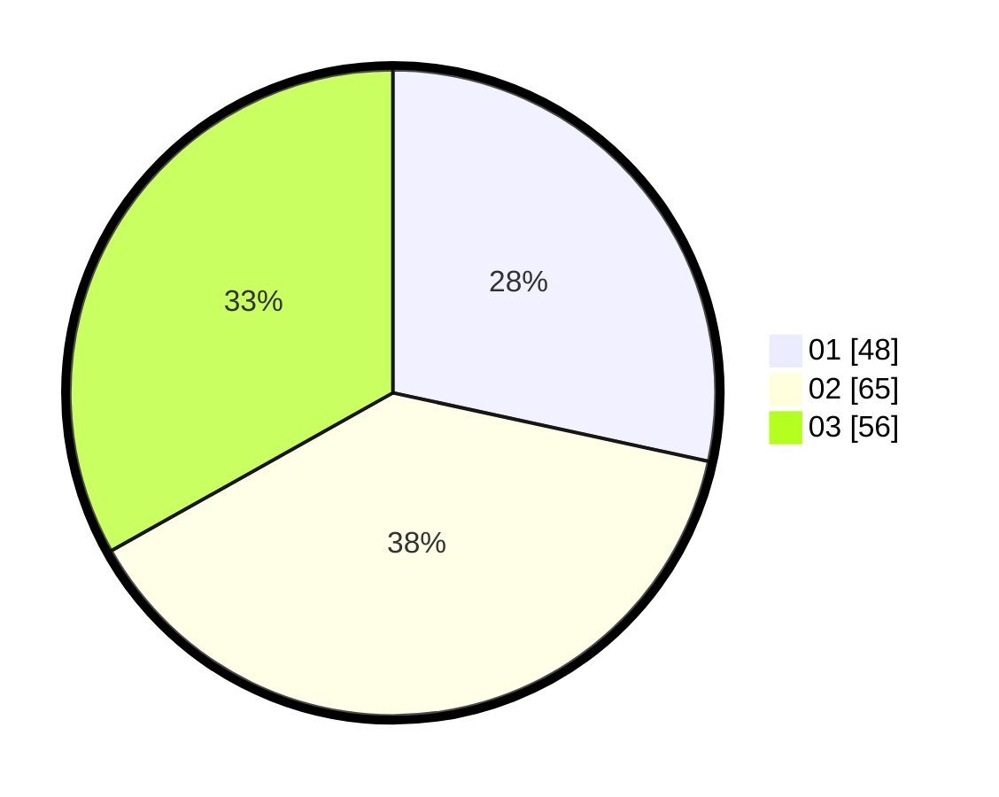

# Hasil

Hasil perolehan suara paslon dapat dilihat pada file paslon-01.txt, paslon-02.txt, dan paslon-03.txt.

Jika tidak ada, artinya data tersebut belum ada pada SIREKAP.

## Perolehan Suara

 * Paslon 01: **48**.
 * Paslon 02: **65**.
 * Paslon 03: **56**.

## Foto C Plano

https://sirekap-obj-formc.kpu.go.id/bd0b/pemilu/ppwp/31/73/04/10/06/3173041006060-20240215-020919--23c1212a-341f-43bb-ba9a-049802280ac5.jpg

https://sirekap-obj-formc.kpu.go.id/bd0b/pemilu/ppwp/31/73/04/10/06/3173041006060-20240215-021032--3a2aae5b-71bd-4710-bae1-45e9fab5c4fb.jpg

https://sirekap-obj-formc.kpu.go.id/bd0b/pemilu/ppwp/31/73/04/10/06/3173041006060-20240215-021149--5842f593-0ebc-411f-9070-0c4cfdcfd9f6.jpg
