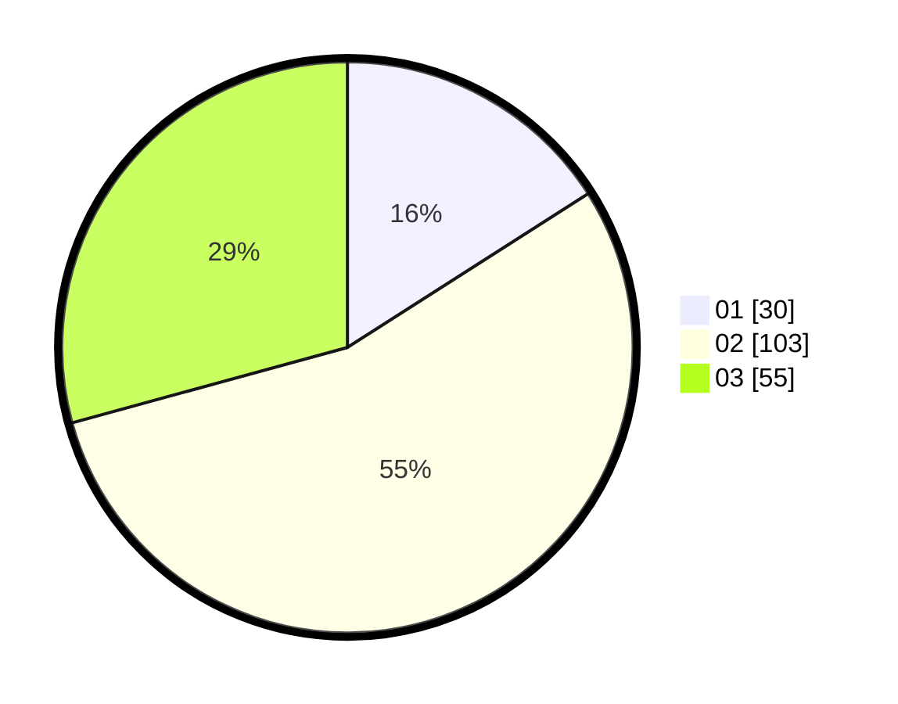

# Hasil

Hasil perolehan suara paslon dapat dilihat pada file paslon-01.txt, paslon-02.txt, dan paslon-03.txt.

Jika tidak ada, artinya data tersebut belum ada pada SIREKAP.

## Perolehan Suara

 * Paslon 01: **30**.
 * Paslon 02: **103**.
 * Paslon 03: **55**.

## Foto C Plano

https://sirekap-obj-formc.kpu.go.id/623b/pemilu/ppwp/31/73/04/10/06/3173041006062-20240214-213550--ea79bc47-1c1e-4b0f-9909-42dcead82b10.jpg

https://sirekap-obj-formc.kpu.go.id/623b/pemilu/ppwp/31/73/04/10/06/3173041006062-20240214-213924--d7fdeb12-f4f4-40d0-80f1-fb0833e161f2.jpg

https://sirekap-obj-formc.kpu.go.id/623b/pemilu/ppwp/31/73/04/10/06/3173041006062-20240214-214221--0a4278cc-799e-418b-ada2-0ec3e3fe2446.jpg
