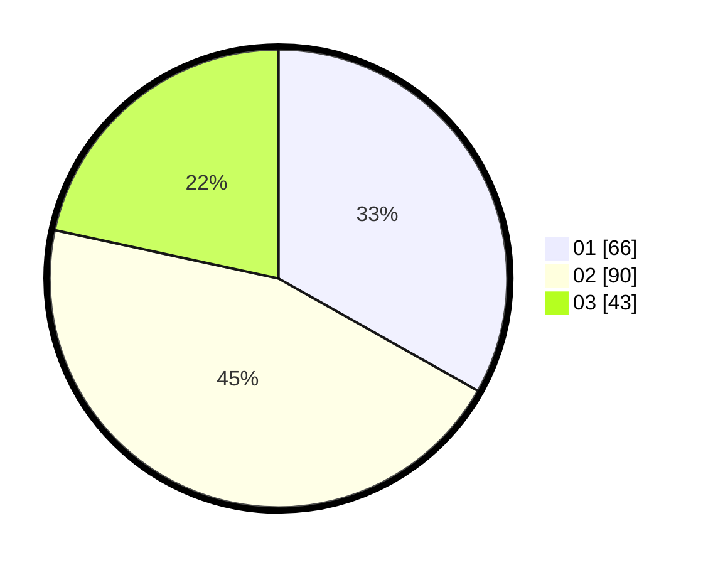

# Hasil

Hasil perolehan suara paslon dapat dilihat pada file paslon-01.txt, paslon-02.txt, dan paslon-03.txt.

Jika tidak ada, artinya data tersebut belum ada pada SIREKAP.

## Perolehan Suara

 * Paslon 01: **66**.
 * Paslon 02: **90**.
 * Paslon 03: **43**.

## Foto C Plano

https://sirekap-obj-formc.kpu.go.id/c772/pemilu/ppwp/31/73/04/10/06/3173041006073-20240214-231305--ab4c6920-c622-4e6d-83fb-94e671874f35.jpg

https://sirekap-obj-formc.kpu.go.id/c772/pemilu/ppwp/31/73/04/10/06/3173041006073-20240214-232053--bfa486ca-1455-4fc9-9361-2be80a3da608.jpg
