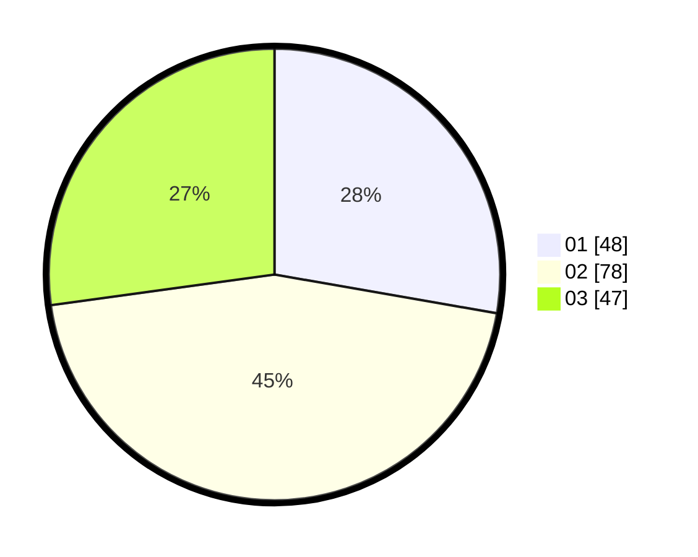

# Hasil

Hasil perolehan suara paslon dapat dilihat pada file paslon-01.txt, paslon-02.txt, dan paslon-03.txt.

Jika tidak ada, artinya data tersebut belum ada pada SIREKAP.

## Perolehan Suara

 * Paslon 01: **48**.
 * Paslon 02: **78**.
 * Paslon 03: **47**.

## Foto C Plano

https://sirekap-obj-formc.kpu.go.id/8b83/pemilu/ppwp/31/73/04/10/06/3173041006075-20240214-195545--a3cfaea9-47c3-49f9-8d97-e57f6b063fa1.jpg

https://sirekap-obj-formc.kpu.go.id/8b83/pemilu/ppwp/31/73/04/10/06/3173041006075-20240214-195601--c8fff81d-5a64-40fd-a908-3572ff651d0f.jpg

https://sirekap-obj-formc.kpu.go.id/8b83/pemilu/ppwp/31/73/04/10/06/3173041006075-20240214-195616--0c19cc26-064b-4dd8-9c7d-3b387ce286f4.jpg
