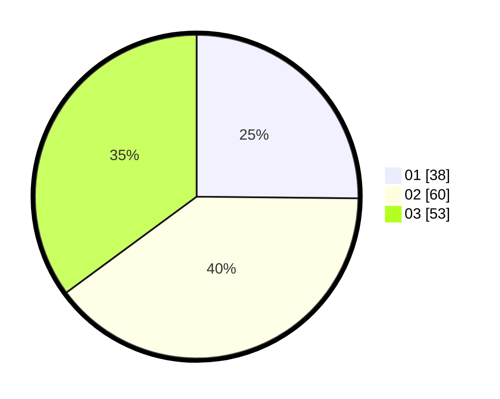

# Hasil

Hasil perolehan suara paslon dapat dilihat pada file paslon-01.txt, paslon-02.txt, dan paslon-03.txt.

Jika tidak ada, artinya data tersebut belum ada pada SIREKAP.

## Perolehan Suara

 * Paslon 01: **38**.
 * Paslon 02: **60**.
 * Paslon 03: **53**.

## Foto C Plano

https://sirekap-obj-formc.kpu.go.id/9383/pemilu/ppwp/31/73/04/10/06/3173041006076-20240214-185550--81832594-82de-4b60-98e0-9a3d82c5e38f.jpg

https://sirekap-obj-formc.kpu.go.id/9383/pemilu/ppwp/31/73/04/10/06/3173041006076-20240214-192532--328a2148-a724-47f1-9e6a-598f3a40425b.jpg

https://sirekap-obj-formc.kpu.go.id/9383/pemilu/ppwp/31/73/04/10/06/3173041006076-20240214-215718--21d0aa8c-551d-4d31-bfe9-ec088437ced3.jpg
