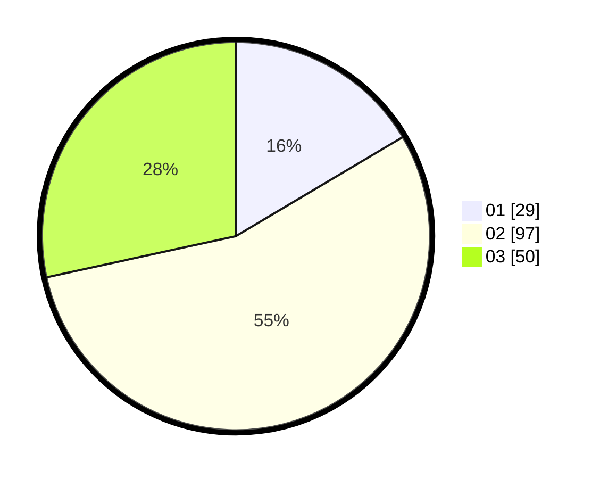

# Hasil

Hasil perolehan suara paslon dapat dilihat pada file paslon-01.txt, paslon-02.txt, dan paslon-03.txt.

Jika tidak ada, artinya data tersebut belum ada pada SIREKAP.

## Perolehan Suara

 * Paslon 01: **29**.
 * Paslon 02: **97**.
 * Paslon 03: **50**.

## Foto C Plano

https://sirekap-obj-formc.kpu.go.id/3da3/pemilu/ppwp/31/73/04/10/06/3173041006077-20240215-051538--cb9d6c52-4ec6-488a-9e30-fbc991aefc11.jpg

https://sirekap-obj-formc.kpu.go.id/3da3/pemilu/ppwp/31/73/04/10/06/3173041006077-20240214-225642--54a7f425-4f20-45a4-940b-3dfc68a12d8d.jpg

https://sirekap-obj-formc.kpu.go.id/3da3/pemilu/ppwp/31/73/04/10/06/3173041006077-20240214-230427--0f0e104c-1445-4613-88b2-f23468dd5bd9.jpg
