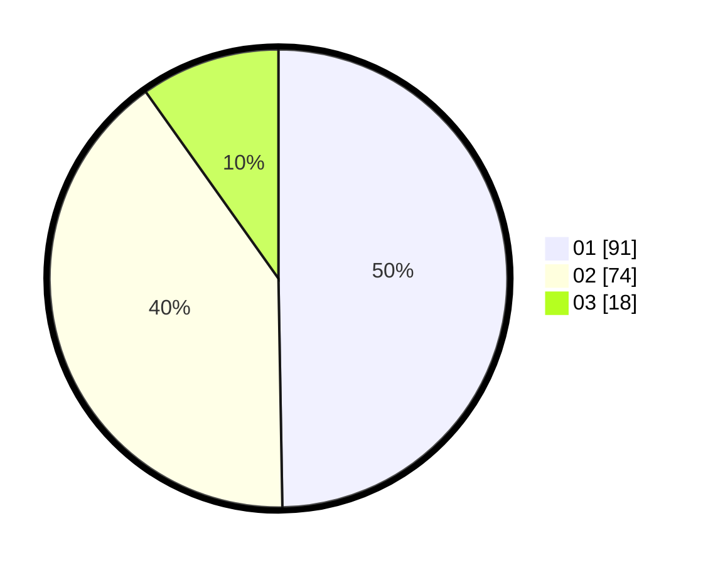

# Hasil

Hasil perolehan suara paslon dapat dilihat pada file paslon-01.txt, paslon-02.txt, dan paslon-03.txt.

Jika tidak ada, artinya data tersebut belum ada pada SIREKAP.

## Perolehan Suara

 * Paslon 01: **91**.
 * Paslon 02: **74**.
 * Paslon 03: **18**.

## Foto C Plano

https://sirekap-obj-formc.kpu.go.id/5160/pemilu/ppwp/31/73/04/10/06/3173041006089-20240214-220333--8ed08a98-840b-45bd-a93a-e0ba79810146.jpg

https://sirekap-obj-formc.kpu.go.id/5160/pemilu/ppwp/31/73/04/10/06/3173041006089-20240214-201453--bdd388f9-47fb-418b-b411-f1787cc38b42.jpg

https://sirekap-obj-formc.kpu.go.id/5160/pemilu/ppwp/31/73/04/10/06/3173041006089-20240214-220506--3ec388c8-46b9-4c70-a01f-26b181c87cc7.jpg
