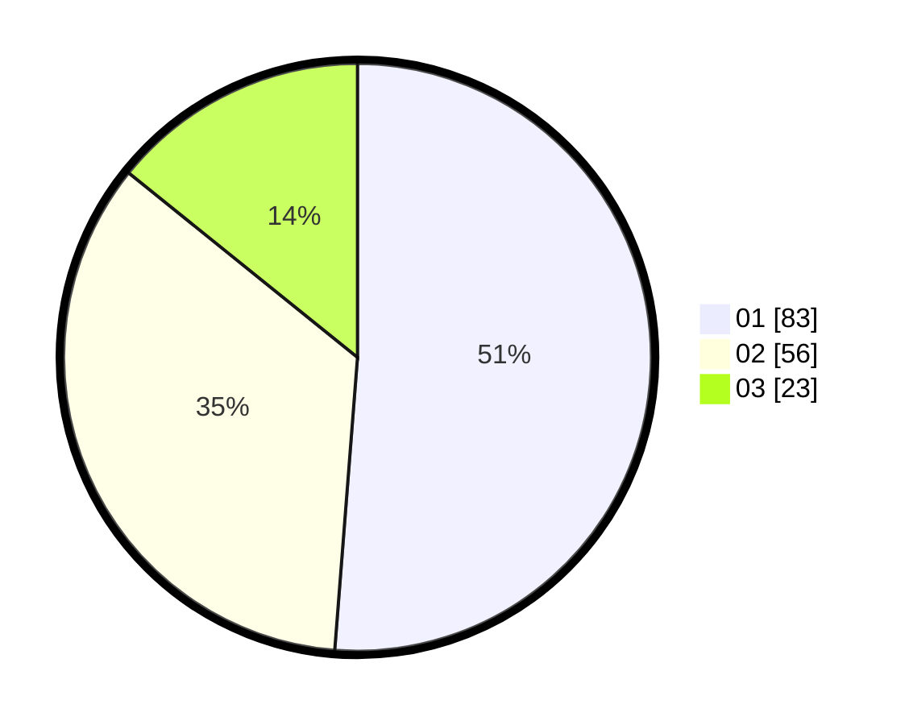

# Hasil

Hasil perolehan suara paslon dapat dilihat pada file paslon-01.txt, paslon-02.txt, dan paslon-03.txt.

Jika tidak ada, artinya data tersebut belum ada pada SIREKAP.

## Perolehan Suara

 * Paslon 01: **83**.
 * Paslon 02: **56**.
 * Paslon 03: **23**.

## Foto C Plano

https://sirekap-obj-formc.kpu.go.id/dc23/pemilu/ppwp/31/73/04/10/06/3173041006092-20240214-235821--4f99eb6b-993a-4108-9ad5-2e6b0bafd966.jpg

https://sirekap-obj-formc.kpu.go.id/dc23/pemilu/ppwp/31/73/04/10/06/3173041006092-20240215-000212--9280da83-67ea-4f92-a890-a2b6974d8b7c.jpg

https://sirekap-obj-formc.kpu.go.id/dc23/pemilu/ppwp/31/73/04/10/06/3173041006092-20240215-000441--77a705fa-c96a-4012-a4a8-8f2c41536dcd.jpg
