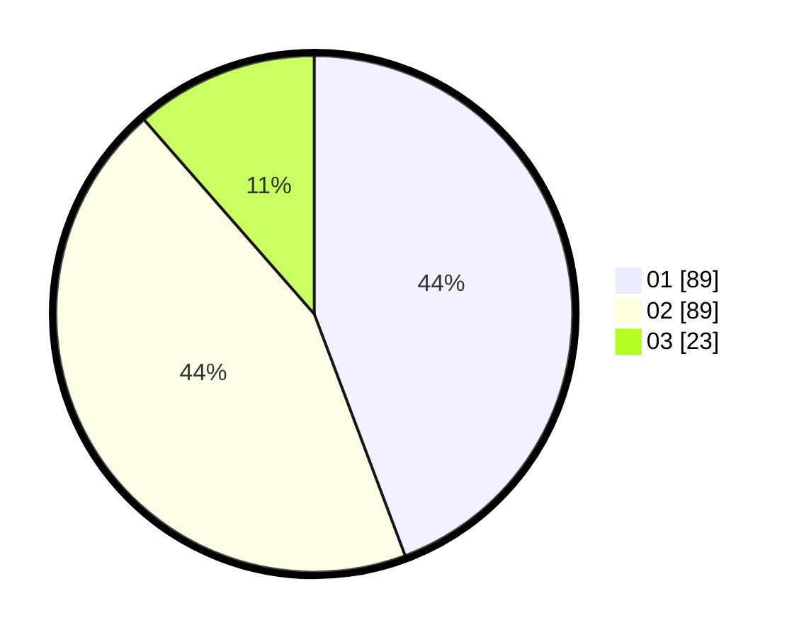

# Hasil

Hasil perolehan suara paslon dapat dilihat pada file paslon-01.txt, paslon-02.txt, dan paslon-03.txt.

Jika tidak ada, artinya data tersebut belum ada pada SIREKAP.

## Perolehan Suara

 * Paslon 01: **89**.
 * Paslon 02: **89**.
 * Paslon 03: **23**.

## Foto C Plano

https://sirekap-obj-formc.kpu.go.id/b550/pemilu/ppwp/31/73/04/10/07/3173041007002-20240214-155619--a933cdc4-9522-48df-b69b-2e58ba6ef498.jpg

https://sirekap-obj-formc.kpu.go.id/b550/pemilu/ppwp/31/73/04/10/07/3173041007002-20240214-155056--0163d18a-0d79-472e-a8bf-2a6c1786cede.jpg

https://sirekap-obj-formc.kpu.go.id/b550/pemilu/ppwp/31/73/04/10/07/3173041007002-20240214-194637--8c837d3f-c14a-4776-8637-70f8d3e3de24.jpg

## DATA PEMILIH TETAP

Jumlah pemilih dalam DPT: **277**.
 * L: **135**.
 * P: **142**.

## DATA PENGGUNA HAK PILIH

Jumlah pengguna hak pilih dalam DPT: **204**.
 * L: **101**.
 * P: **103**.

Jumlah pengguna hak pilih dalam DPTb: **1**.
 * L: **0**.
 * P: **1**.

Jumlah pengguna hak pilih dalam DPK: **0**.
 * L: **0**.
 * P: **0**.

Jumlah pengguna hak pilih: **205**.
 * L: **101**.
 * P: **104**.

## JUMLAH SUARA SAH DAN TIDAK SAH

JUMLAH SELURUH SUARA SAH: **201**.

JUMLAH SUARA TIDAK SAH: **4**.

JUMLAH SELURUH SUARA SAH DAN SUARA TIDAK SAH: **205**.
