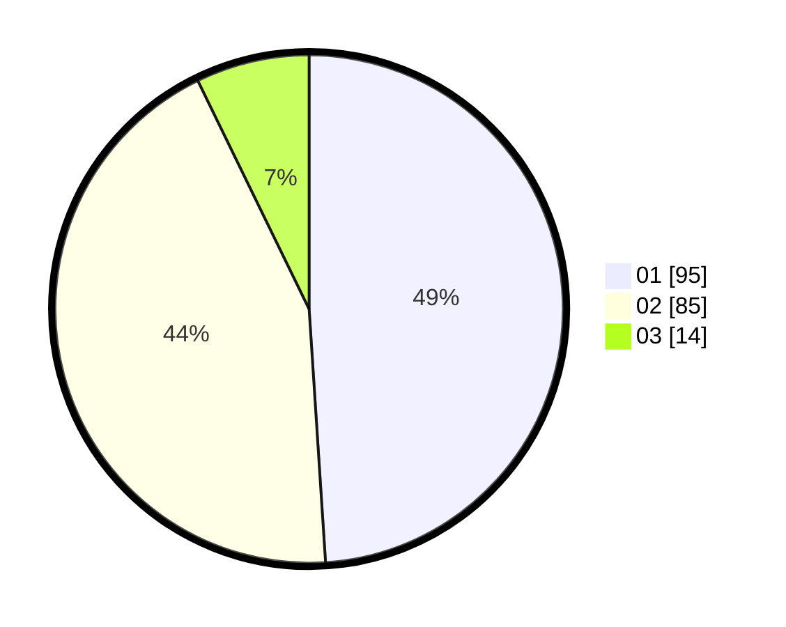

# Hasil

Hasil perolehan suara paslon dapat dilihat pada file paslon-01.txt, paslon-02.txt, dan paslon-03.txt.

Jika tidak ada, artinya data tersebut belum ada pada SIREKAP.

## Perolehan Suara

 * Paslon 01: **95**.
 * Paslon 02: **85**.
 * Paslon 03: **14**.

## Foto C Plano

https://sirekap-obj-formc.kpu.go.id/b11c/pemilu/ppwp/31/73/04/10/07/3173041007003-20240214-212128--c7f3a090-c27b-4f4f-a277-eaf5a27512a6.jpg

https://sirekap-obj-formc.kpu.go.id/b11c/pemilu/ppwp/31/73/04/10/07/3173041007003-20240214-224928--61de9bb5-d714-4b51-9132-bd64d5de833b.jpg

https://sirekap-obj-formc.kpu.go.id/b11c/pemilu/ppwp/31/73/04/10/07/3173041007003-20240214-195255--12ba9fd1-8ca1-4baf-bc9c-fb7e798dff76.jpg

## DATA PEMILIH TETAP

Jumlah pemilih dalam DPT: **243**.
 * L: **128**.
 * P: **115**.

## DATA PENGGUNA HAK PILIH

Jumlah pengguna hak pilih dalam DPT: **195**.
 * L: **99**.
 * P: **96**.

Jumlah pengguna hak pilih dalam DPTb: **0**.
 * L: **0**.
 * P: **0**.

Jumlah pengguna hak pilih dalam DPK: **0**.
 * L: **0**.
 * P: **0**.

Jumlah pengguna hak pilih: **195**.
 * L: **99**.
 * P: **96**.

## JUMLAH SUARA SAH DAN TIDAK SAH

JUMLAH SELURUH SUARA SAH: **194**.

JUMLAH SUARA TIDAK SAH: **1**.

JUMLAH SELURUH SUARA SAH DAN SUARA TIDAK SAH: **195**.
