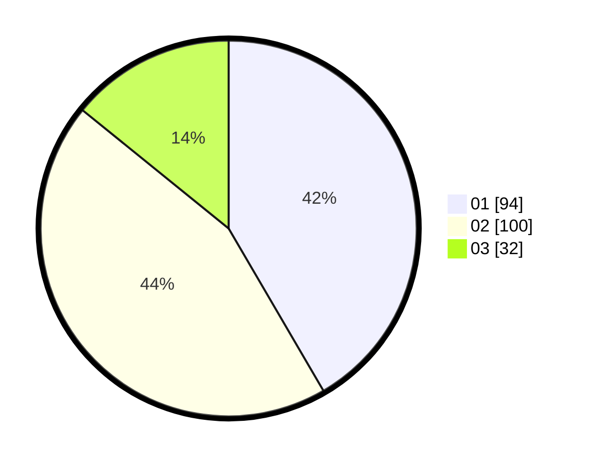

# Hasil

Hasil perolehan suara paslon dapat dilihat pada file paslon-01.txt, paslon-02.txt, dan paslon-03.txt.

Jika tidak ada, artinya data tersebut belum ada pada SIREKAP.

## Perolehan Suara

 * Paslon 01: **94**.
 * Paslon 02: **100**.
 * Paslon 03: **32**.

## Foto C Plano

https://sirekap-obj-formc.kpu.go.id/6dd3/pemilu/ppwp/31/73/04/10/07/3173041007009-20240214-224454--4a77d5e5-7952-4f3f-b311-b076be8fbebe.jpg

https://sirekap-obj-formc.kpu.go.id/6dd3/pemilu/ppwp/31/73/04/10/07/3173041007009-20240214-231658--d3b1e765-7656-4753-846c-493a2faffcc8.jpg

https://sirekap-obj-formc.kpu.go.id/6dd3/pemilu/ppwp/31/73/04/10/07/3173041007009-20240214-231402--bd47ffe2-6a5d-4588-9b81-6bb178a700a3.jpg
