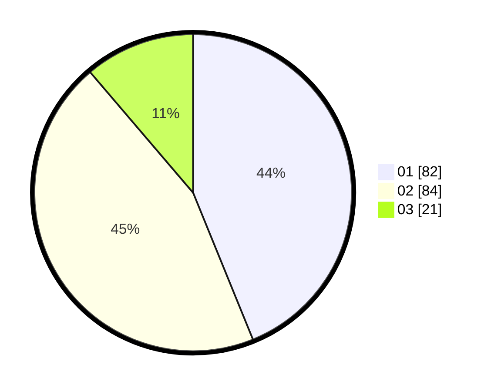

# Hasil

Hasil perolehan suara paslon dapat dilihat pada file paslon-01.txt, paslon-02.txt, dan paslon-03.txt.

Jika tidak ada, artinya data tersebut belum ada pada SIREKAP.

## Perolehan Suara

 * Paslon 01: **82**.
 * Paslon 02: **84**.
 * Paslon 03: **21**.

## Foto C Plano

https://sirekap-obj-formc.kpu.go.id/adff/pemilu/ppwp/31/73/04/10/07/3173041007010-20240214-200450--644700af-0946-4e7e-a9d1-6eb5be398271.jpg

https://sirekap-obj-formc.kpu.go.id/adff/pemilu/ppwp/31/73/04/10/07/3173041007010-20240214-192057--bcdfcd32-0987-42e9-b31c-bc78cfc917c2.jpg

https://sirekap-obj-formc.kpu.go.id/adff/pemilu/ppwp/31/73/04/10/07/3173041007010-20240214-200250--521c8176-70a6-49e8-a6be-052041167c50.jpg

## DATA PEMILIH TETAP

Jumlah pemilih dalam DPT: **269**.
 * L: **139**.
 * P: **130**.

## DATA PENGGUNA HAK PILIH

Jumlah pengguna hak pilih dalam DPT: **193**.
 * L: **94**.
 * P: **99**.

Jumlah pengguna hak pilih dalam DPTb: **1**.
 * L: **1**.
 * P: **0**.

Jumlah pengguna hak pilih dalam DPK: **0**.
 * L: **0**.
 * P: **0**.

Jumlah pengguna hak pilih: **194**.
 * L: **95**.
 * P: **99**.

## JUMLAH SUARA SAH DAN TIDAK SAH

JUMLAH SELURUH SUARA SAH: **187**.

JUMLAH SUARA TIDAK SAH: **7**.

JUMLAH SELURUH SUARA SAH DAN SUARA TIDAK SAH: **194**.
