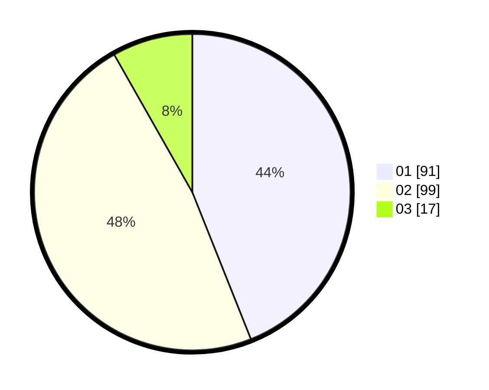

# Hasil

Hasil perolehan suara paslon dapat dilihat pada file paslon-01.txt, paslon-02.txt, dan paslon-03.txt.

Jika tidak ada, artinya data tersebut belum ada pada SIREKAP.

## Perolehan Suara

 * Paslon 01: **91**.
 * Paslon 02: **99**.
 * Paslon 03: **17**.

## Foto C Plano

https://sirekap-obj-formc.kpu.go.id/af3f/pemilu/ppwp/31/73/04/10/07/3173041007014-20240214-214924--67d6dcef-1b18-4ae3-8224-71db7f34955b.jpg

https://sirekap-obj-formc.kpu.go.id/af3f/pemilu/ppwp/31/73/04/10/07/3173041007014-20240214-215421--5c7c2dc6-2226-4c76-bf91-4065123a04db.jpg

https://sirekap-obj-formc.kpu.go.id/af3f/pemilu/ppwp/31/73/04/10/07/3173041007014-20240214-215320--dc1f012c-ebf4-4a5a-b1a4-6fc99913f772.jpg
