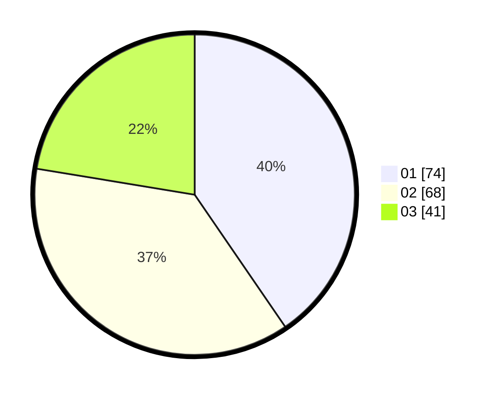

# Hasil

Hasil perolehan suara paslon dapat dilihat pada file paslon-01.txt, paslon-02.txt, dan paslon-03.txt.

Jika tidak ada, artinya data tersebut belum ada pada SIREKAP.

## Perolehan Suara

 * Paslon 01: **74**.
 * Paslon 02: **68**.
 * Paslon 03: **41**.

## Foto C Plano

https://sirekap-obj-formc.kpu.go.id/dd06/pemilu/ppwp/31/73/04/10/07/3173041007015-20240214-221359--3ff88abe-598a-4a99-a910-6896426f5d73.jpg

https://sirekap-obj-formc.kpu.go.id/dd06/pemilu/ppwp/31/73/04/10/07/3173041007015-20240214-213329--20613585-e395-4203-a445-7adf83fc7d87.jpg

https://sirekap-obj-formc.kpu.go.id/dd06/pemilu/ppwp/31/73/04/10/07/3173041007015-20240214-214204--39b1c9a5-8a3b-4afd-b089-57e52392b43a.jpg
