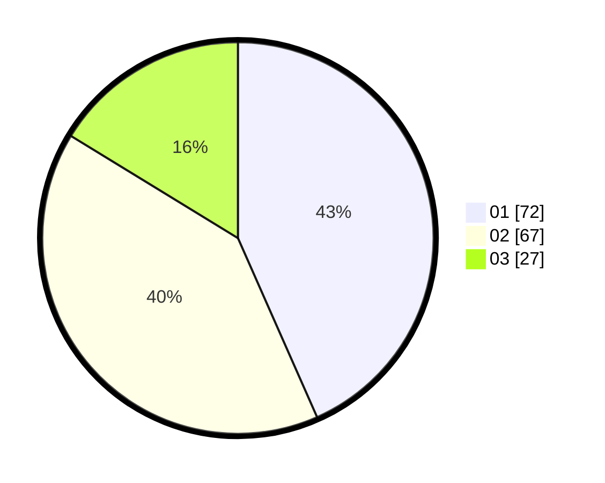

# Hasil

Hasil perolehan suara paslon dapat dilihat pada file paslon-01.txt, paslon-02.txt, dan paslon-03.txt.

Jika tidak ada, artinya data tersebut belum ada pada SIREKAP.

## Perolehan Suara

 * Paslon 01: **72**.
 * Paslon 02: **67**.
 * Paslon 03: **27**.

## Foto C Plano

https://sirekap-obj-formc.kpu.go.id/4a44/pemilu/ppwp/31/73/04/10/07/3173041007016-20240214-162224--728b21d8-31bf-4d81-abb5-60418bd7d899.jpg

https://sirekap-obj-formc.kpu.go.id/4a44/pemilu/ppwp/31/73/04/10/07/3173041007016-20240214-204320--8e7a1251-f7c5-491f-99d0-c999135f577b.jpg

https://sirekap-obj-formc.kpu.go.id/4a44/pemilu/ppwp/31/73/04/10/07/3173041007016-20240214-191813--58999a86-bfcf-430e-bce8-112a057e28ba.jpg

## DATA PEMILIH TETAP

Jumlah pemilih dalam DPT: **206**.
 * L: **101**.
 * P: **105**.

## DATA PENGGUNA HAK PILIH

Jumlah pengguna hak pilih dalam DPT: **169**.
 * L: **84**.
 * P: **85**.

Jumlah pengguna hak pilih dalam DPTb: **0**.
 * L: **0**.
 * P: **0**.

Jumlah pengguna hak pilih dalam DPK: **0**.
 * L: **0**.
 * P: **0**.

Jumlah pengguna hak pilih: **169**.
 * L: **84**.
 * P: **85**.

## JUMLAH SUARA SAH DAN TIDAK SAH

JUMLAH SELURUH SUARA SAH: **166**.

JUMLAH SUARA TIDAK SAH: **3**.

JUMLAH SELURUH SUARA SAH DAN SUARA TIDAK SAH: **169**.
