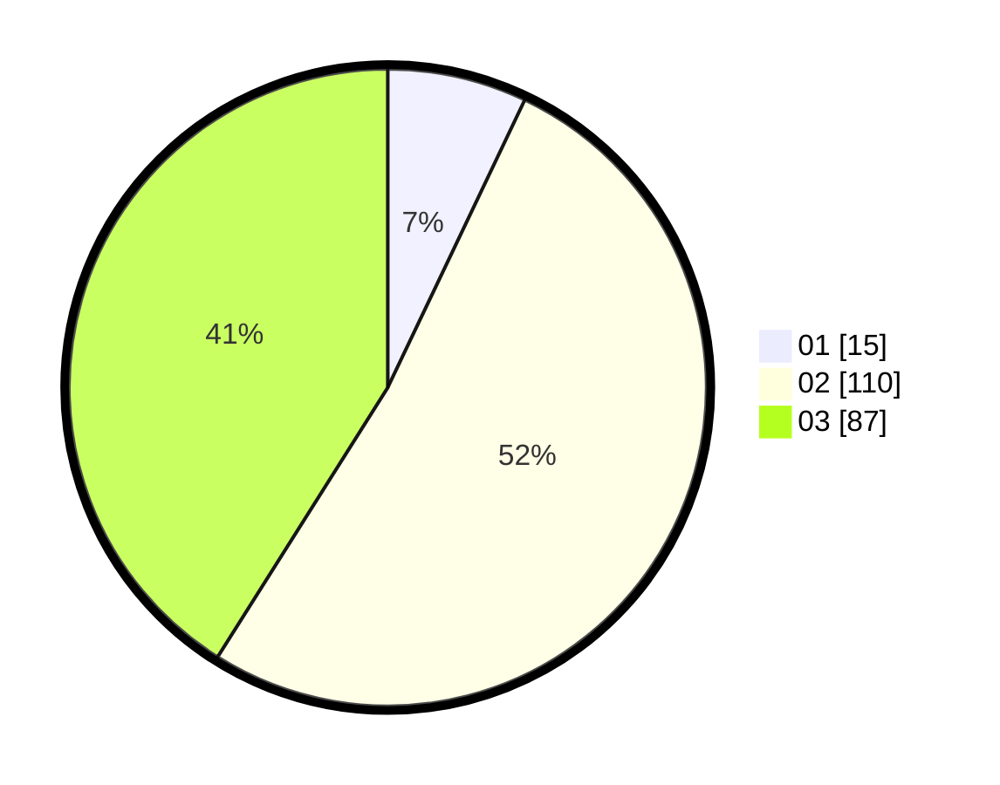

# Hasil

Hasil perolehan suara paslon dapat dilihat pada file paslon-01.txt, paslon-02.txt, dan paslon-03.txt.

Jika tidak ada, artinya data tersebut belum ada pada SIREKAP.

## Perolehan Suara

 * Paslon 01: **15**.
 * Paslon 02: **110**.
 * Paslon 03: **87**.

## Foto C Plano

https://sirekap-obj-formc.kpu.go.id/563b/pemilu/ppwp/31/73/04/10/07/3173041007020-20240214-193736--c1c20a6a-3dd5-49c5-b237-d24b8d7d76eb.jpg

https://sirekap-obj-formc.kpu.go.id/563b/pemilu/ppwp/31/73/04/10/07/3173041007020-20240214-195300--81be7ee6-d6a1-49d5-a55c-859038fa9821.jpg

https://sirekap-obj-formc.kpu.go.id/563b/pemilu/ppwp/31/73/04/10/07/3173041007020-20240215-220930--3e849b7f-b3ff-45a3-b08c-71f3a9ae32fa.jpg

## DATA PEMILIH TETAP

Jumlah pemilih dalam DPT: **273**.
 * L: **132**.
 * P: **141**.

## DATA PENGGUNA HAK PILIH

Jumlah pengguna hak pilih dalam DPT: **212**.
 * L: **102**.
 * P: **110**.

Jumlah pengguna hak pilih dalam DPTb: **0**.
 * L: **0**.
 * P: **0**.

Jumlah pengguna hak pilih dalam DPK: **1**.
 * L: **0**.
 * P: **1**.

Jumlah pengguna hak pilih: **213**.
 * L: **102**.
 * P: **111**.

## JUMLAH SUARA SAH DAN TIDAK SAH

JUMLAH SELURUH SUARA SAH: **212**.

JUMLAH SUARA TIDAK SAH: **1**.

JUMLAH SELURUH SUARA SAH DAN SUARA TIDAK SAH: **213**.
