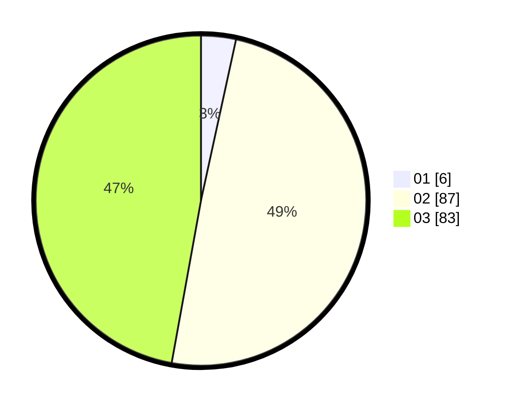

# Hasil

Hasil perolehan suara paslon dapat dilihat pada file paslon-01.txt, paslon-02.txt, dan paslon-03.txt.

Jika tidak ada, artinya data tersebut belum ada pada SIREKAP.

## Perolehan Suara

 * Paslon 01: **6**.
 * Paslon 02: **87**.
 * Paslon 03: **83**.

## Foto C Plano

https://sirekap-obj-formc.kpu.go.id/c9b1/pemilu/ppwp/31/73/04/10/07/3173041007021-20240216-090136--7971d9d5-8bb5-44b1-a598-10063d1d5c31.jpg

https://sirekap-obj-formc.kpu.go.id/c9b1/pemilu/ppwp/31/73/04/10/07/3173041007021-20240216-090139--a563aeb1-f8e8-4cc0-b277-94c7ff93c6bc.jpg

https://sirekap-obj-formc.kpu.go.id/c9b1/pemilu/ppwp/31/73/04/10/07/3173041007021-20240214-155548--1b74535b-9d2a-4236-8f9a-27eba6d0614d.jpg

## DATA PEMILIH TETAP

Jumlah pemilih dalam DPT: **280**.
 * L: **133**.
 * P: **147**.

## DATA PENGGUNA HAK PILIH

Jumlah pengguna hak pilih dalam DPT: **178**.
 * L: **82**.
 * P: **96**.

Jumlah pengguna hak pilih dalam DPTb: **0**.
 * L: **0**.
 * P: **0**.

Jumlah pengguna hak pilih dalam DPK: **0**.
 * L: **0**.
 * P: **0**.

Jumlah pengguna hak pilih: **178**.
 * L: **82**.
 * P: **96**.

## JUMLAH SUARA SAH DAN TIDAK SAH

JUMLAH SELURUH SUARA SAH: **176**.

JUMLAH SUARA TIDAK SAH: **2**.

JUMLAH SELURUH SUARA SAH DAN SUARA TIDAK SAH: **178**.
