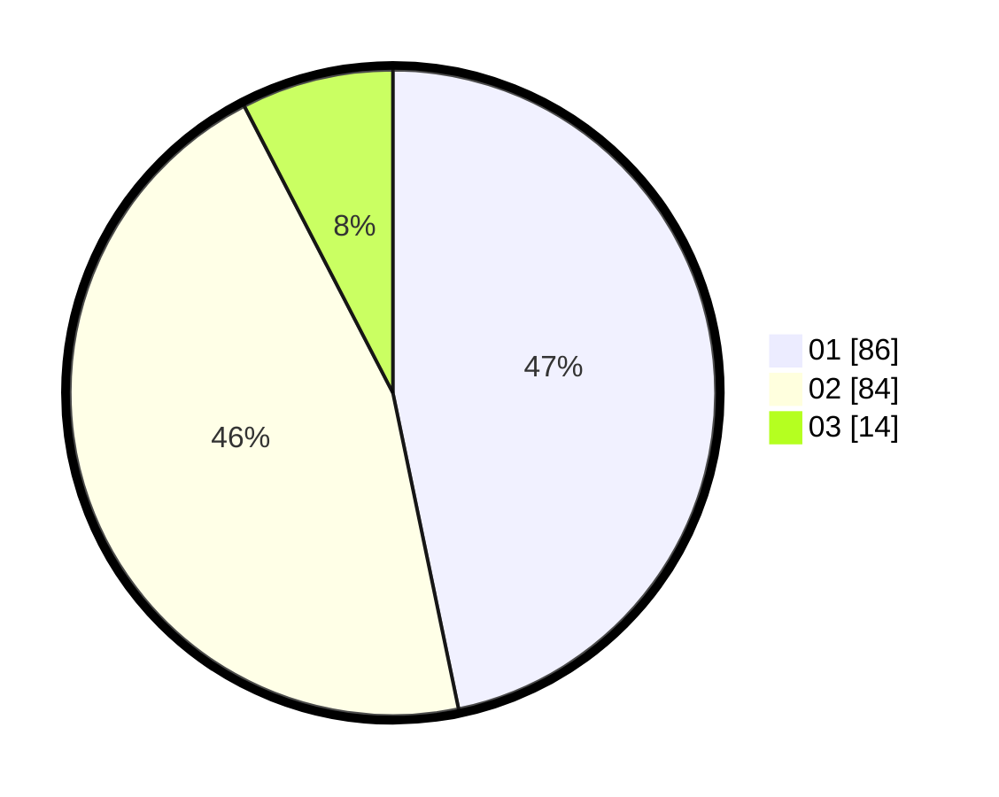

# Hasil

Hasil perolehan suara paslon dapat dilihat pada file paslon-01.txt, paslon-02.txt, dan paslon-03.txt.

Jika tidak ada, artinya data tersebut belum ada pada SIREKAP.

## Perolehan Suara

 * Paslon 01: **86**.
 * Paslon 02: **84**.
 * Paslon 03: **14**.

## Foto C Plano

https://sirekap-obj-formc.kpu.go.id/b442/pemilu/ppwp/31/73/04/10/07/3173041007023-20240214-222638--7449aedc-c0af-4deb-b2fb-7d4924880af1.jpg

https://sirekap-obj-formc.kpu.go.id/b442/pemilu/ppwp/31/73/04/10/07/3173041007023-20240214-222751--b0aaec12-8cd5-4608-9a04-1f7b1e2663f2.jpg

https://sirekap-obj-formc.kpu.go.id/b442/pemilu/ppwp/31/73/04/10/07/3173041007023-20240214-223031--b74cf3da-9faa-4299-babe-ec46fbb0b227.jpg
